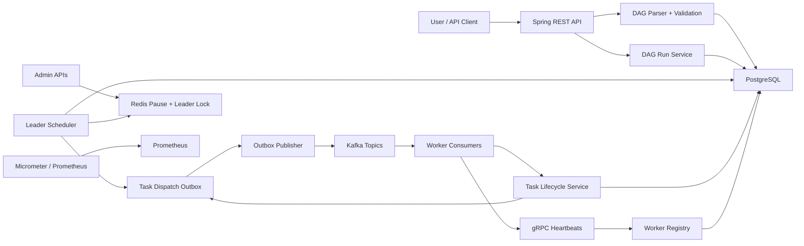
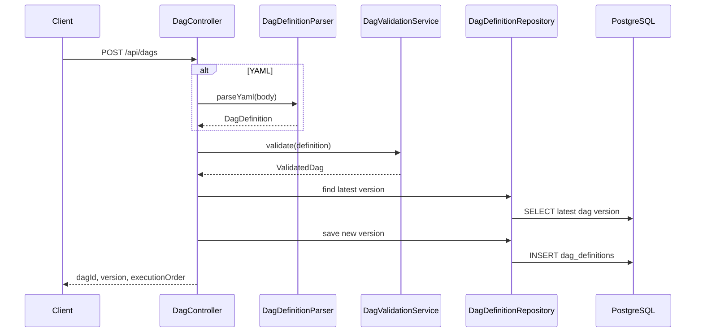
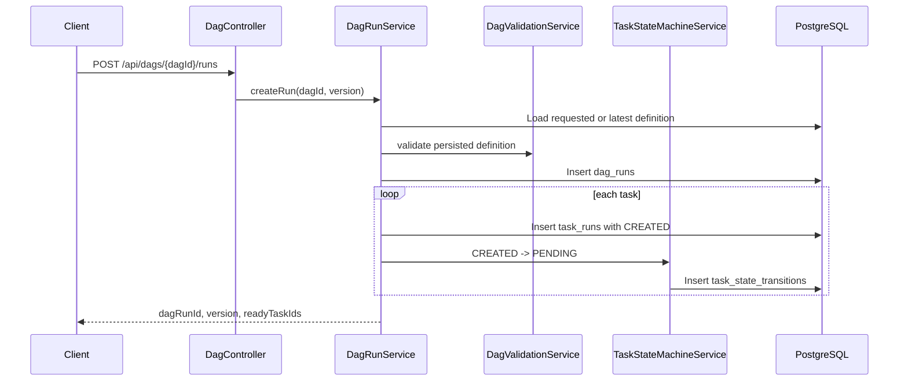
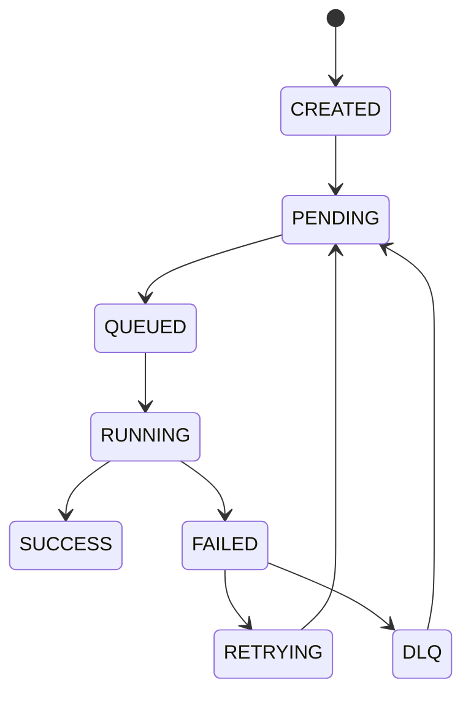
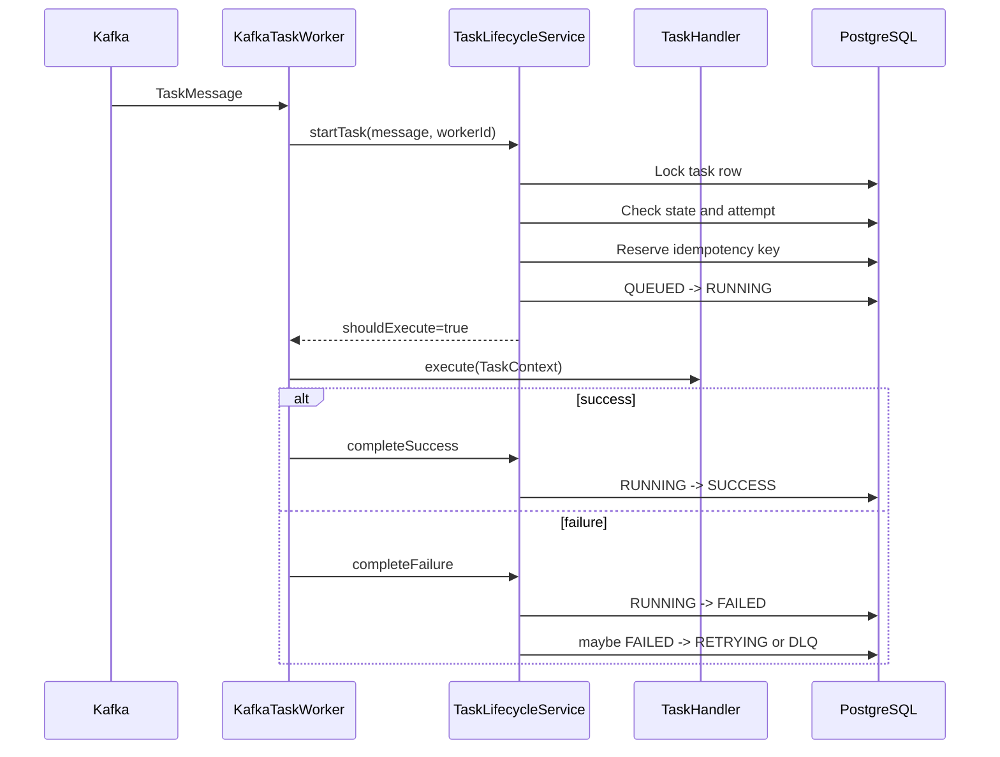

# FlowMesh Complete Learning Guide

FlowMesh is a distributed DAG orchestration engine. Users submit workflow definitions, FlowMesh validates and versions them, creates workflow runs, schedules dependency-ready tasks, dispatches tasks through Kafka, executes them on horizontally scalable workers, records task state transitions, handles retries and DLQ, and exposes operational controls and metrics.

## How To Use This Guide

Read it in this order:

1. Understand the mental model: DAG definition, DAG run, task run.
2. Trace one happy-path workflow from API request to worker completion.
3. Study the reliability mechanisms: transactions, row locks, outbox, idempotency, retries, DLQ, leader election.
4. Study the operating layer: Docker Compose, metrics, logs, timeline API, pause/resume.
5. Use the SWE2 prep sections to practice explaining tradeoffs and proposing improvements.

When a section references a class, open that file while reading. The most important files are:

- `src/main/java/com/flowmesh/dag/api/DagController.java`
- `src/main/java/com/flowmesh/dag/service/DagValidationService.java`
- `src/main/java/com/flowmesh/dag/run/DagRunService.java`
- `src/main/java/com/flowmesh/dag/run/SchedulingService.java`
- `src/main/java/com/flowmesh/dag/run/TaskRunRepository.java`
- `src/main/java/com/flowmesh/dag/run/TaskLifecycleService.java`
- `src/main/java/com/flowmesh/kafka/KafkaTaskPublisher.java`
- `src/main/java/com/flowmesh/kafka/outbox/KafkaOutboxPublisher.java`
- `src/main/java/com/flowmesh/worker/KafkaTaskWorker.java`
- `src/main/java/com/flowmesh/scheduler/leader/RedisRedlockLeaderElection.java`

## Project In One Sentence

FlowMesh accepts DAG definitions, persists immutable versions, creates executable task-run rows, uses a leader scheduler to queue only dependency-ready tasks, publishes task messages through a PostgreSQL outbox into Kafka, lets workers execute tasks idempotently, and records every state transition for auditability.

## Core Mental Model

There are three levels of data:

| Level | Meaning | Example | Stored In |
| --- | --- | --- | --- |
| DAG definition | The blueprint submitted by a user | `daily-pipeline` with `extract -> transform -> load` | `dag_definitions` |
| DAG run | One execution of one immutable DAG version | Run UUID for version 3 of `daily-pipeline` | `dag_runs` |
| Task run | One task instance inside a DAG run | `load` task for that run | `task_runs` |

Why this matters:

- A DAG definition is reusable.
- A DAG run pins a specific version, so future edits do not change already-started runs.
- Task runs are the actual schedulable and executable units.

If someone asks "where is the workflow state?", the answer is: task-level runtime state lives in `task_runs`, audit history lives in `task_state_transitions`, and DAG-level run state exists in `dag_runs`.

## High-Level Architecture



Important architecture split:

- Control plane: API, validation, versioning, scheduler, admin controls.
- Data plane: Kafka task topics, workers, task execution.
- Reliability plane: PostgreSQL transactions, row locks, outbox, idempotency keys, retries, DLQ.
- Observability plane: timeline table, MDC logs, Micrometer metrics, Prometheus.

## Package Map

| Package | Responsibility |
| --- | --- |
| `com.flowmesh.dag.api` | REST API DTOs and DAG endpoints |
| `com.flowmesh.dag.model` | In-memory DAG and task definition records |
| `com.flowmesh.dag.service` | Parsing, validation, graph algorithms, version submission |
| `com.flowmesh.dag.persistence` | Immutable DAG definition JPA entity and repository |
| `com.flowmesh.dag.run` | Runtime state, scheduler loop, lifecycle transitions, timeout enforcement |
| `com.flowmesh.kafka` | Kafka message records, topic config, publisher interface |
| `com.flowmesh.kafka.outbox` | Transactional outbox rows and scheduled Kafka publisher |
| `com.flowmesh.worker` | Kafka workers, worker properties, runtime task state |
| `com.flowmesh.worker.handler` | Pluggable handlers for task types |
| `com.flowmesh.worker.grpc` | Worker registration and heartbeat protocol |
| `com.flowmesh.scheduler` | Leader election and pause/resume admin controls |
| `com.flowmesh.dedup` | Idempotency reservation table |
| `com.flowmesh.dlq` | Dead-letter queue persistence, inspection, manual requeue |
| `com.flowmesh.timeline` | Task state transition audit API |
| `com.flowmesh.common` | API errors, logging MDC helpers, metrics |

## Technology Stack And Why It Is Used

### Java 21

Why:

- Strong typing helps model workflow state and message contracts.
- Records are useful for immutable DTOs like `DagDefinition`, `TaskDefinition`, and Kafka messages.
- Mature ecosystem for Spring, Kafka, JPA, gRPC, and metrics.

How this project uses it:

- Records define API/message payloads.
- Enums define task and DAG states.
- Services are Spring beans.
- JPA entities model database tables.

### Spring Boot 3

Why:

- Provides fast service bootstrapping.
- Integrates REST, JPA, Redis, Kafka, scheduling, validation, and actuator.
- Makes feature toggles easy with configuration properties.

How this project uses it:

- `@SpringBootApplication` starts the app.
- `@EnableScheduling` enables scheduled loops.
- `@ConfigurationPropertiesScan` loads `flowmesh.scheduler` and `flowmesh.worker` settings.
- `@RestController` exposes APIs.
- `@Transactional` defines database transaction boundaries.
- `@ConditionalOnProperty` turns scheduler/worker/DLQ/retry components on and off.

### PostgreSQL

Why:

- Durable source of truth for definitions, runs, task state, transitions, outbox rows, DLQ rows, and worker registrations.
- Row-level locks are essential for safe concurrent scheduling.
- JSONB stores flexible DAG and task payloads without schema churn.

How this project uses it:

- `dag_definitions` stores immutable versions.
- `task_runs` stores schedulable task state.
- `task_run_dependencies` stores dependency edges.
- `task_dispatch_outbox` stores outbound Kafka messages before publishing.
- `FOR UPDATE SKIP LOCKED` allows multiple schedulers or publishers to safely compete without double-processing the same row.

### Flyway

Why:

- Keeps schema changes versioned and repeatable.
- Avoids Hibernate auto-generating uncontrolled production schema.

How this project uses it:

- `V1__core_dag_schema.sql` creates definitions, runs, task runs, and dependencies.
- `V2__runtime_features.sql` adds runtime fields, timeline, dedupe, DLQ, and worker registrations.
- `V3__task_dispatch_outbox.sql` adds the outbox table.
- `spring.jpa.hibernate.ddl-auto=validate` checks that entities match the migrated schema.

### Kafka

Why:

- Decouples scheduling from task execution.
- Enables horizontal worker scaling through consumer groups.
- Partitions allow many workers to process tasks concurrently.

How this project uses it:

- Tasks are published to type-specific topics: `tasks.http_call`, `tasks.sql_query`, `tasks.ml_inference`.
- Retry and DLQ events go to `tasks.retry` and `tasks.dlq`.
- Workers consume supported task topics as a shared consumer group.
- Consumers use `read_committed` so they do not see aborted transactional Kafka writes.

### Redis

Why:

- Provides fast ephemeral coordination state.
- Good fit for scheduler leader lock and pause flags.

How this project uses it:

- `flowmesh:scheduler:leader` stores the leader-election token with a TTL.
- `flowmesh:scheduler:pause:all` pauses all scheduling.
- `flowmesh:scheduler:pause:dag:{dagId}` pauses one DAG.

### gRPC

Why:

- Efficient service-to-service protocol for worker registration and heartbeats.
- Strong schema through Protocol Buffers.

How this project uses it:

- Workers call scheduler-side `RegisterWorker`.
- Workers periodically call `Heartbeat`.
- Heartbeats update worker registry state and task-run heartbeat timestamps.

### Micrometer And Prometheus

Why:

- Production systems need operational visibility.
- Prometheus can scrape metrics for dashboards and alerts.

How this project uses it:

- Exposes `/actuator/prometheus`.
- Records scheduling rate, retry rate, DLQ rate, queue depth, leader election events, scheduling latency, and execution latency.

## Runtime Modes

The same jar can run as API-only, scheduler, worker, or a combined service depending on configuration.

Default `application.yml`:

- `flowmesh.scheduler.enabled=false`
- `flowmesh.worker.enabled=false`
- `flowmesh.dlq.consumer-enabled=false`
- `flowmesh.retry.consumer-enabled=false`
- `flowmesh.observability.kafka-depth-enabled=false`

This lets the service boot for API-only development with PostgreSQL and Redis, without requiring Kafka-driven scheduling.

`docker-compose.yml` enables a distributed demo:

- One scheduler exposed on port `8080` and gRPC port `9091`.
- Two standby schedulers.
- Five workers.
- PostgreSQL, Redis, Kafka, and Prometheus.

Why separate scheduler and worker roles:

- Scheduler instances coordinate readiness and dispatch.
- Worker instances execute task payloads.
- Scaling them independently mirrors real production systems. You may need more workers for CPU-heavy task execution, or more scheduler capacity for many small tasks.

<details>
<summary>Important snippet: default role toggles in application.yml</summary>

```yaml
flowmesh:
  scheduler:
    enabled: false
    batch-size: 50
    heartbeat-timeout-secs: 30
    poll-delay-ms: 1000
    leader-renew-ms: 5000
    timeout-scan-delay-ms: 5000
  worker:
    enabled: false
    supported-task-types:
      - http_call
      - sql_query
      - ml_inference
    max-concurrent: 4
  dlq:
    consumer-enabled: false
  retry:
    consumer-enabled: false
```

Why this snippet matters:

- The jar starts in API-only mode by default.
- Scheduler, worker, retry, and DLQ roles are opt-in.

</details>

<details>
<summary>Important snippet: Compose runs separate scheduler and worker roles</summary>

```yaml
scheduler:
  <<: *flowmesh-app
  environment:
    <<: *flowmesh-env
    FLOWMESH_SCHEDULER_ENABLED: "true"
    FLOWMESH_WORKER_ENABLED: "false"
  ports:
    - "8080:8080"
    - "9091:9091"

worker-1:
  <<: *flowmesh-app
  environment:
    <<: *flowmesh-env
    FLOWMESH_SCHEDULER_ENABLED: "false"
    FLOWMESH_WORKER_ENABLED: "true"
    FLOWMESH_WORKER_WORKER_ID: worker-1
    FLOWMESH_WORKER_SCHEDULER_GRPC_HOST: scheduler
    FLOWMESH_WORKER_SCHEDULER_GRPC_PORT: 9091
```

Why this snippet matters:

- Same image, different role flags.
- Workers connect to scheduler gRPC using the Compose service name.

</details>

## DAG Definition Model

### `DagDefinition`

File: `src/main/java/com/flowmesh/dag/model/DagDefinition.java`

Fields:

- `dagId`: stable workflow identifier.
- `name`: human-readable name.
- `tasks`: list of task definitions.

Important details:

- `@NotBlank` and `@NotEmpty` apply API-level validation.
- Constructor replaces null `tasks` with an empty immutable list.
- The record is annotated with `@JsonIgnoreProperties(ignoreUnknown = true)`, so extra fields in submitted JSON/YAML are ignored.

Why immutable-like records:

- Definitions should not be mutated once parsed.
- Immutable data is easier to reason about in validation and persistence.

<details>
<summary>Important snippet: immutable DAG definition record</summary>

```java
@JsonIgnoreProperties(ignoreUnknown = true)
public record DagDefinition(
        @NotBlank String dagId,
        @NotBlank String name,
        @NotEmpty @Valid List<TaskDefinition> tasks
) {
    public DagDefinition {
        tasks = tasks == null ? List.of() : Collections.unmodifiableList(new ArrayList<>(tasks));
    }
}
```

Why this snippet matters:

- Bean validation catches missing `dagId`, `name`, and empty task lists.
- `@Valid` cascades validation into each `TaskDefinition`.
- The constructor defensively copies the task list and makes it unmodifiable.

</details>

### `TaskDefinition`

File: `src/main/java/com/flowmesh/dag/model/TaskDefinition.java`

Fields:

- `taskId`: unique within the DAG.
- `type`: routes to a worker handler and Kafka topic.
- `dependsOn`: upstream task ids.
- `config`: arbitrary task configuration.
- `timeoutSecs`: execution timeout.
- `retries`: retry budget.
- `successBranch`: optional downstream branch for success.
- `failureBranch`: optional downstream branch for failure.

Defaults:

- Timeout defaults to `300` seconds.
- Retries default to `3`.
- Null dependencies become an empty list.
- Null config becomes an empty map.
- Blank branch values become null.

Why config is `Map<String, Object>`:

- Different task types need different payloads.
- The orchestrator should not need a schema migration for every handler-specific config key.

Tradeoff:

- Flexible config improves extensibility.
- Runtime validation is weaker than strongly typed task-specific config classes.

<details>
<summary>Important snippet: task defaults, config, dependencies, and branch aliases</summary>

```java
@JsonIgnoreProperties(ignoreUnknown = true)
public record TaskDefinition(
        @NotBlank String taskId,
        @NotBlank String type,
        List<@NotBlank String> dependsOn,
        Map<String, Object> config,
        @Min(1) Integer timeoutSecs,
        @Min(0) Integer retries,
        @JsonAlias("success_branch") String successBranch,
        @JsonAlias("failure_branch") String failureBranch
) {
    public static final int DEFAULT_TIMEOUT_SECS = 300;
    public static final int DEFAULT_RETRIES = 3;

    public TaskDefinition {
        dependsOn = dependsOn == null ? List.of() : Collections.unmodifiableList(new ArrayList<>(dependsOn));
        config = config == null ? Map.of() : Collections.unmodifiableMap(new LinkedHashMap<>(config));
        timeoutSecs = timeoutSecs == null ? DEFAULT_TIMEOUT_SECS : timeoutSecs;
        retries = retries == null ? DEFAULT_RETRIES : retries;
        successBranch = successBranch == null || successBranch.isBlank() ? null : successBranch;
        failureBranch = failureBranch == null || failureBranch.isBlank() ? null : failureBranch;
    }
}
```

Why this snippet matters:

- Defaults are applied at the boundary, so downstream code can assume timeout and retry values exist.
- JSON aliases let API payloads use `success_branch` and Java code use `successBranch`.
- The task `type` later becomes the Kafka topic suffix and handler lookup key.

</details>

### Branching Semantics

Branch fields:

- `success_branch` maps to `successBranch`.
- `failure_branch` maps to `failureBranch`.

The branch target must:

- Exist as a task.
- Not be the same task.
- Depend on the branching task.

Why the branch target must depend on the branching task:

- It keeps the graph structure honest.
- The scheduler can use dependency readiness rules rather than a separate branch-routing system.
- It avoids a task running before the branch decision exists.

Example:

```json
{
  "taskId": "classify",
  "type": "http_call",
  "success_branch": "ship",
  "failure_branch": "fallback"
}
```

Then both `ship` and `fallback` must include `"classify"` in their `dependsOn`.

## DAG Submission Flow

Entry points:

- `POST /api/dags` with JSON.
- `POST /api/dags` with YAML.

Main classes:

- `DagController`
- `DagDefinitionParser`
- `DagSubmissionService`
- `DagValidationService`
- `DagDefinitionRepository`

Flow:



What happens in detail:

1. Controller receives a JSON or YAML DAG.
2. YAML bodies are parsed by Jackson YAML in `DagDefinitionParser`.
3. Bean validation catches missing required top-level fields.
4. `DagValidationService` checks graph correctness.
5. `DagSubmissionService` finds the latest version for this `dagId`.
6. It saves a new immutable version with `version = latest + 1`, or `1` if this is new.
7. The persisted entity stores the original definition JSON and precomputed execution order JSON.

<details>
<summary>Important snippet: JSON and YAML API entry points</summary>

```java
@PostMapping(path = "/dags", consumes = MediaType.APPLICATION_JSON_VALUE)
public DagSubmissionResponse submitJson(@Valid @RequestBody DagDefinition definition) {
    return dagSubmissionService.submit(definition);
}

@PostMapping(path = "/dags", consumes = {APPLICATION_YAML, APPLICATION_X_YAML, TEXT_YAML})
public DagSubmissionResponse submitYaml(@RequestBody String yaml) {
    DagDefinition definition = dagDefinitionParser.parseYaml(yaml);
    validate(definition);
    return dagSubmissionService.submit(definition);
}
```

Why this snippet matters:

- JSON submission uses Spring/Jackson body binding directly.
- YAML submission parses a raw string first, then manually runs Bean Validation.
- Both paths converge into the same `DagSubmissionService.submit` method.

</details>

<details>
<summary>Important snippet: YAML parser keeps the same DAG model</summary>

```java
public DagDefinition parseYaml(String yaml) {
    try {
        return yamlMapper.readValue(yaml, DagDefinition.class);
    } catch (JsonProcessingException exception) {
        throw new DagValidationException("INVALID_DAG", "Unable to parse DAG YAML");
    }
}
```

Why this snippet matters:

- YAML is treated as another input format, not a separate domain model.
- Parser failures become API-friendly `DagValidationException` errors.

</details>

<details>
<summary>Important snippet: immutable version creation</summary>

```java
@Transactional(transactionManager = "transactionManager")
public DagSubmissionResponse submit(DagDefinition definition) {
    ValidatedDag validatedDag = dagValidationService.validate(definition);
    int nextVersion = dagDefinitionRepository.findTopByDagIdOrderByVersionDesc(definition.dagId())
            .map(existing -> existing.getVersion() + 1)
            .orElse(1);

    DagDefinitionEntity entity = DagDefinitionEntity.create(
            definition.dagId(),
            nextVersion,
            definition.name(),
            writeJson(definition),
            writeJson(validatedDag.executionOrder())
    );
    DagDefinitionEntity saved = dagDefinitionRepository.save(entity);

    return new DagSubmissionResponse(
            saved.getDagId(),
            saved.getVersion(),
            saved.getName(),
            definition.tasks().size(),
            validatedDag.executionOrder(),
            saved.getCreatedAt()
    );
}
```

Why this snippet matters:

- Validation runs before persistence.
- Version number is derived from the latest persisted version.
- The execution order is stored with the definition for fast inspection.

</details>

Why immutable versioning matters:

- Suppose version 1 has `extract -> load`.
- A run starts against version 1.
- Later, a user submits version 2 with `extract -> transform -> load`.
- The existing run must continue using version 1, otherwise a live workflow could change underneath execution.

This is a classic orchestration requirement: definitions are mutable over time, runs are not.

## DAG Validation In Depth

Main class: `DagValidationService`

Validation checks:

- Definition is not null.
- Each task has a nonblank id.
- Each task has a nonblank type.
- Task ids are unique.
- Dependencies are nonblank.
- Dependencies reference existing tasks.
- Branch references exist.
- Branches do not point to self.
- Branch targets depend on the branching task.
- Graph has no cycles.
- Topological sort succeeds.

Output: `ValidatedDag`

`ValidatedDag` includes:

- Original definition.
- `tasksById`, a lookup map.
- `dependentsByTaskId`, reverse dependency map.
- `executionOrder`, topological order.
- `initialReadyTaskIds`, tasks with no dependencies.

Why return more than just "valid":

- Scheduling and UI responses often need graph-derived metadata.
- Computing once during validation avoids duplicated graph code.
- It makes tests easier because validation output can be asserted directly.

<details>
<summary>Important snippet: building task lookup, rejecting duplicates, and producing graph metadata</summary>

```java
Map<String, TaskDefinition> tasksById = new LinkedHashMap<>();
for (TaskDefinition task : definition.tasks()) {
    if (task.taskId() == null || task.taskId().isBlank()) {
        throw new DagValidationException("INVALID_TASK", "Task id is required");
    }
    if (task.type() == null || task.type().isBlank()) {
        throw new DagValidationException("INVALID_TASK", "Task type is required for task '" + task.taskId() + "'");
    }
    if (tasksById.putIfAbsent(task.taskId(), task) != null) {
        throw new DagValidationException(
                "DUPLICATE_TASK_ID",
                "Task id '" + task.taskId() + "' is declared more than once"
        );
    }
}

cycleDetector.findCycle(tasksById).ifPresent(path -> {
    throw new CycleDetectedException(path);
});

List<String> executionOrder = topologicalSorter.sort(tasksById);
Map<String, List<String>> dependentsByTaskId = buildDependents(tasksById);
List<String> initialReadyTaskIds = tasksById.values().stream()
        .filter(task -> task.dependsOn().isEmpty())
        .map(TaskDefinition::taskId)
        .toList();
```

Why this snippet matters:

- `tasksById` is the central lookup used for dependency and branch validation.
- Cycle detection and topological sort are separate components, keeping graph logic focused.
- `initialReadyTaskIds` are just tasks with no dependencies; actual scheduling readiness is later handled by SQL.

</details>

<details>
<summary>Important snippet: branch target validation</summary>

```java
private void validateBranchReference(
        Map<String, TaskDefinition> tasksById,
        TaskDefinition task,
        String branchTaskId,
        String branchName
) {
    if (branchTaskId == null) {
        return;
    }
    if (!tasksById.containsKey(branchTaskId)) {
        throw new DagValidationException(
                "UNKNOWN_BRANCH",
                "Task '" + task.taskId() + "' has unknown " + branchName + " task '" + branchTaskId + "'"
        );
    }
    if (task.taskId().equals(branchTaskId)) {
        throw new DagValidationException(
                "INVALID_BRANCH",
                "Task '" + task.taskId() + "' cannot branch to itself"
        );
    }
    if (!tasksById.get(branchTaskId).dependsOn().contains(task.taskId())) {
        throw new DagValidationException(
                "INVALID_BRANCH",
                "Task '" + task.taskId() + "' " + branchName + " target '" + branchTaskId
                        + "' must depend on '" + task.taskId() + "'"
        );
    }
}
```

Why this snippet matters:

- Branch targets must be downstream of the branching task.
- That rule lets the scheduler implement branch decisions through dependency readiness.

</details>

## Graph Algorithms

### Cycle Detection

Class: `DagCycleDetector`

Algorithm: depth-first search with visit states.

States:

- No state: task has not been explored.
- `VISITING`: task is on the current recursion stack.
- `VISITED`: task and its dependencies are fully explored.

Why this detects cycles:

- A cycle exists if DFS reaches a node already marked `VISITING`.
- That means the node is already on the current path.

Example:

```text
taskA depends on taskB
taskB depends on taskA
```

DFS path:

```text
taskA -> taskB -> taskA
```

When `taskA` is seen again while still `VISITING`, FlowMesh returns a cycle path.

Complexity:

- Time: `O(V + E)` where `V` is task count and `E` is dependency count.
- Space: `O(V)` for visit state and stack.

Why cycle detection is mandatory:

- A DAG must be acyclic.
- If cycles were allowed, tasks could wait forever for dependencies that can never complete first.

<details>
<summary>Important snippet: DFS cycle detection with a recursion stack</summary>

```java
private Optional<List<String>> dfs(
        String taskId,
        Map<String, TaskDefinition> tasksById,
        Map<String, VisitState> stateByTaskId,
        List<String> stack,
        Map<String, Integer> stackIndexByTaskId
) {
    stateByTaskId.put(taskId, VisitState.VISITING);
    stackIndexByTaskId.put(taskId, stack.size());
    stack.add(taskId);

    for (String dependencyId : tasksById.get(taskId).dependsOn()) {
        VisitState dependencyState = stateByTaskId.get(dependencyId);
        if (dependencyState == VisitState.VISITING) {
            int cycleStart = stackIndexByTaskId.get(dependencyId);
            List<String> cycle = new ArrayList<>(stack.subList(cycleStart, stack.size()));
            cycle.add(dependencyId);
            return Optional.of(cycle);
        }

        if (dependencyState == null) {
            Optional<List<String>> cycle = dfs(
                    dependencyId,
                    tasksById,
                    stateByTaskId,
                    stack,
                    stackIndexByTaskId
            );
            if (cycle.isPresent()) {
                return cycle;
            }
        }
    }

    stack.remove(stack.size() - 1);
    stackIndexByTaskId.remove(taskId);
    stateByTaskId.put(taskId, VisitState.VISITED);
    return Optional.empty();
}
```

Why this snippet matters:

- `VISITING` means the task is on the current path.
- Seeing another `VISITING` task creates a precise cycle path for the API response.

</details>

### Topological Sort

Class: `TopologicalSorter`

Algorithm: Kahn's algorithm.

Steps:

1. Compute in-degree for every task.
2. Put all zero in-degree tasks into a queue.
3. Repeatedly remove a ready task.
4. Reduce in-degree of each dependent.
5. When a dependent reaches zero, add it to the queue.

Why this matters:

- Topological order proves a valid dependency-respecting execution order exists.
- It also gives a useful human-readable execution plan in API responses.

Important distinction:

- Topological order is not the exact runtime order.
- Runtime order is affected by worker availability, Kafka partitioning, retries, timeouts, branches, and pause flags.

<details>
<summary>Important snippet: Kahn topological sort</summary>

```java
Queue<String> ready = new ArrayDeque<>();
inDegreeByTaskId.forEach((taskId, inDegree) -> {
    if (inDegree == 0) {
        ready.add(taskId);
    }
});

List<String> orderedTaskIds = new ArrayList<>(tasksById.size());
while (!ready.isEmpty()) {
    String taskId = ready.remove();
    orderedTaskIds.add(taskId);

    for (String dependentId : dependentsByTaskId.get(taskId)) {
        int nextInDegree = inDegreeByTaskId.computeIfPresent(dependentId, (ignored, current) -> current - 1);
        if (nextInDegree == 0) {
            ready.add(dependentId);
        }
    }
}

if (orderedTaskIds.size() != tasksById.size()) {
    throw new DagValidationException("INVALID_DAG", "Topological sort failed because the DAG is cyclic");
}
```

Why this snippet matters:

- Zero in-degree tasks are ready because they have no unmet dependencies.
- If all nodes cannot be ordered, the graph is cyclic or invalid.

</details>

## Persistence Model

The database is the system of record.

### Main Tables

| Table | Purpose |
| --- | --- |
| `dag_definitions` | Immutable DAG versions |
| `dag_runs` | One execution of one DAG version |
| `task_runs` | Runtime task instances |
| `task_run_dependencies` | Dependency edges for runtime scheduling |
| `task_state_transitions` | Audit trail for task state changes |
| `task_deduplication` | Idempotency reservations |
| `task_dispatch_outbox` | Outbound Kafka messages waiting to publish |
| `dlq_tasks` | Failed tasks requiring manual attention |
| `worker_registrations` | Registered workers and heartbeat state |

<details>
<summary>Important snippet: immutable DAG definition table</summary>

```sql
create table dag_definitions (
    id uuid primary key,
    dag_id varchar(120) not null,
    version integer not null,
    name varchar(240) not null,
    definition_json jsonb not null,
    execution_order_json jsonb not null,
    created_at timestamptz not null,
    constraint uk_dag_definitions_dag_id_version unique (dag_id, version)
);

create index idx_dag_definitions_dag_id on dag_definitions (dag_id);
```

Why this snippet matters:

- `(dag_id, version)` uniqueness enforces immutable version identity.
- JSONB stores the submitted definition and computed execution order.

</details>

<details>
<summary>Important snippet: task run and dependency tables</summary>

```sql
create table task_runs (
    id uuid primary key,
    dag_run_id uuid not null references dag_runs (id) on delete cascade,
    task_id varchar(160) not null,
    type varchar(120) not null,
    state varchar(24) not null,
    attempt integer not null,
    timeout_secs integer not null,
    retries integer not null,
    created_at timestamptz not null,
    queued_at timestamptz,
    started_at timestamptz,
    finished_at timestamptz,
    updated_at timestamptz not null,
    constraint uk_task_runs_dag_run_task unique (dag_run_id, task_id)
);

create table task_run_dependencies (
    task_run_id uuid not null references task_runs (id) on delete cascade,
    depends_on_task_id varchar(160) not null,
    primary key (task_run_id, depends_on_task_id)
);
```

Why this snippet matters:

- `uk_task_runs_dag_run_task` makes `dagRunId + taskId` a stable lookup pair.
- Dependencies are persisted relationally so readiness can be evaluated in SQL.

</details>

### Why Store Dependencies Separately

`task_run_dependencies` lets the scheduler ask SQL questions like:

```text
Which PENDING tasks have no unsatisfied dependencies?
```

That question is answered inside the database using joins, not by loading every task into application memory.

Why this is important:

- It scales better for large DAGs.
- It allows row locking around the exact tasks being scheduled.
- It lets multiple scheduler instances safely run the same query with `SKIP LOCKED`.

### Why Store JSONB

FlowMesh uses JSONB for:

- Full DAG definitions.
- Execution order.
- Task config.
- Transition details.
- Outbox payloads.
- Supported worker task types.

Why:

- These payloads are flexible and task-type-specific.
- PostgreSQL still stores them durably and can index/query JSONB later if needed.

Tradeoff:

- JSONB fields are less explicit than relational columns.
- If a field becomes critical for querying, it may deserve a dedicated column.

## Creating A DAG Run

Endpoint:

- `POST /api/dags/{dagId}/runs`
- Optional query parameter: `version`

Main class: `DagRunService`

Flow:



What the code does:

- Loads the requested DAG version, or latest version if not specified.
- Parses persisted JSON back into `DagDefinition`.
- Validates again. This is defensive: persisted data should be valid, but validation protects the runtime path.
- Creates a `DagRunEntity`.
- Marks it `RUNNING`.
- Creates one `TaskRunEntity` per task.
- Transitions each task from `CREATED` to `PENDING`.
- Returns initial ready task ids.

Important detail:

All tasks become `PENDING`, not only root tasks. Readiness is decided later by the scheduler query. This is a good design because the database can be the single source for "is this task ready yet?"

<details>
<summary>Important snippet: creating a DAG run and task runs</summary>

```java
@Transactional(transactionManager = "transactionManager")
public DagRunResponse createRun(String dagId, Integer requestedVersion) {
    DagDefinitionEntity definitionEntity = findDefinition(dagId, requestedVersion);
    DagDefinition definition = readDefinition(definitionEntity);
    ValidatedDag validatedDag = dagValidationService.validate(definition);

    DagRunEntity newRun = DagRunEntity.create(definitionEntity);
    newRun.markRunning();
    DagRunEntity run = dagRunRepository.save(newRun);

    definition.tasks().forEach(task -> {
        TaskRunEntity taskRun = taskRunRepository.save(TaskRunEntity.create(
                run,
                task,
                TaskState.CREATED,
                writeJson(task.config())
        ));
        taskStateMachineService.transition(taskRun, TaskState.PENDING, "dag_run_created");
    });

    return new DagRunResponse(
            run.getId(),
            run.getDagId(),
            run.getVersion(),
            run.getStatus(),
            validatedDag.initialReadyTaskIds()
    );
}
```

Why this snippet matters:

- A run pins one `DagDefinitionEntity`.
- Every task gets a runtime row immediately.
- The state machine records the first transition for every task.

</details>

## Task State Machine

Main class: `TaskStateMachineService`

Allowed transitions:



Why a state machine exists:

- It prevents impossible jumps like `PENDING -> SUCCESS`.
- It creates a single place to enforce lifecycle rules.
- It writes an audit event for every transition.

Each transition creates a `TaskStateTransitionEntity`, which powers:

- The timeline API.
- Debugging.
- Operational audit trails.
- Postmortem analysis.

State meanings:

| State | Meaning |
| --- | --- |
| `CREATED` | Task row exists but is not schedulable yet |
| `PENDING` | Task may become ready when dependencies are satisfied |
| `QUEUED` | Scheduler has dispatched task to Kafka |
| `RUNNING` | Worker reserved and started the task |
| `SUCCESS` | Worker completed successfully |
| `FAILED` | Current attempt failed |
| `RETRYING` | Waiting for retry backoff to elapse |
| `DLQ` | Retry budget exhausted and task needs manual action |

SWE2 point:

A state machine is a simple but powerful reliability tool. It converts scattered boolean flags into explicit lifecycle rules.

<details>
<summary>Important snippet: allowed transitions map</summary>

```java
private static final Map<TaskState, Set<TaskState>> ALLOWED_TRANSITIONS = Map.of(
        TaskState.CREATED, Set.of(TaskState.PENDING),
        TaskState.PENDING, Set.of(TaskState.QUEUED),
        TaskState.QUEUED, Set.of(TaskState.RUNNING),
        TaskState.RUNNING, Set.of(TaskState.SUCCESS, TaskState.FAILED),
        TaskState.FAILED, Set.of(TaskState.RETRYING, TaskState.DLQ),
        TaskState.RETRYING, Set.of(TaskState.PENDING),
        TaskState.DLQ, Set.of(TaskState.PENDING),
        TaskState.SUCCESS, Set.of()
);
```

Why this snippet matters:

- The state machine explicitly defines legal lifecycle movement.
- `SUCCESS` is terminal, while `DLQ` can be manually requeued to `PENDING`.

</details>

<details>
<summary>Important snippet: transition enforcement and audit write</summary>

```java
public void transition(TaskRunEntity taskRun, TaskState nextState, String reason, String detailsJson) {
    TaskState previousState = taskRun.getState();
    if (!ALLOWED_TRANSITIONS.getOrDefault(previousState, Set.of()).contains(nextState)) {
        throw new IllegalStateException(
                "Invalid task state transition " + previousState + " -> " + nextState
                        + " for task '" + taskRun.getTaskId() + "'"
        );
    }

    taskRun.transitionTo(nextState);
    transitionRepository.save(TaskStateTransitionEntity.create(
            taskRun,
            previousState,
            nextState,
            reason,
            detailsJson
    ));
}
```

Why this snippet matters:

- Invalid jumps fail fast.
- Every valid transition produces timeline/audit data.

</details>

<details>
<summary>Important snippet: task entity updates timestamps during transitions</summary>

```java
public void transitionTo(TaskState nextState) {
    this.state = nextState;
    Instant now = Instant.now();
    if (nextState == TaskState.QUEUED) {
        queuedAt = now;
    } else if (nextState == TaskState.RUNNING) {
        startedAt = now;
        lastHeartbeatAt = now;
    } else if (nextState == TaskState.SUCCESS || nextState == TaskState.FAILED || nextState == TaskState.DLQ) {
        finishedAt = now;
        workerId = null;
    } else if (nextState == TaskState.RETRYING) {
        workerId = null;
    }
}
```

Why this snippet matters:

- State transitions also update operational fields like `queuedAt`, `startedAt`, and `finishedAt`.
- Clearing `workerId` on terminal/retry states prevents stale worker ownership.

</details>

## Scheduling In Depth

Main classes:

- `SchedulingLoop`
- `SchedulingService`
- `TaskRunRepository`
- `SchedulingPauseService`
- `RedisRedlockLeaderElection`

The scheduler only runs when:

- `flowmesh.scheduler.enabled=true`
- The current instance is Redis leader.

High-level scheduling loop:

1. Scheduled method runs every `flowmesh.scheduler.poll-delay-ms`.
2. If this instance is not leader, return.
3. Promote due retrying tasks from `RETRYING` to `PENDING`.
4. Lock dependency-ready pending tasks.
5. Skip tasks if global or DAG-level pause is active.
6. Transition each selected task `PENDING -> QUEUED`.
7. Create an outbox row containing a `TaskMessage`.
8. Record metrics and logs.

<details>
<summary>Important snippet: scheduled loop only runs on the leader</summary>

```java
@Scheduled(fixedDelayString = "${flowmesh.scheduler.poll-delay-ms:1000}")
public void pollReadyTasks() {
    if (!leaderElection.isLeader()) {
        return;
    }
    List<TaskDispatch> dispatches = schedulingService.queueReadyTasks(batchSize);
    for (TaskDispatch dispatch : dispatches) {
        log.info(
                "Queued task for dispatch dagRunId={} taskId={} topic={} idempotencyKey={}",
                dispatch.dagRunId(),
                dispatch.taskId(),
                dispatch.topic(),
                dispatch.idempotencyKey()
        );
    }
}
```

Why this snippet matters:

- All scheduler replicas may run this method, but only the leader does scheduling work.
- Logging includes the dispatch topic and idempotency key for debugging.

</details>

<details>
<summary>Important snippet: queueing ready tasks and writing to the publisher boundary</summary>

```java
@Transactional(transactionManager = "transactionManager")
public List<TaskDispatch> queueReadyTasks(int limit) {
    promoteDueRetries(limit);

    List<TaskDispatch> dispatches = new ArrayList<>();
    for (TaskRunEntity taskRun : taskRunRepository.lockReadyPendingTasks(limit)) {
        if (pauseService.isPaused(taskRun.getDagRun().getDagId())) {
            continue;
        }

        try (MdcScopes.Scope ignored = MdcScopes.task(taskRun.getDagRun().getId(), taskRun.getTaskId(), null)) {
            stateMachineService.transition(taskRun, TaskState.QUEUED, "scheduler_ready");
            TaskDispatch dispatch = TaskDispatch.from(taskRun);
            taskPublisher.publish(toMessage(dispatch));
            metrics.recordTaskScheduled();
            recordSchedulingLatency(taskRun);
            dispatches.add(dispatch);
        }
    }
    return List.copyOf(dispatches);
}
```

Why this snippet matters:

- Retry promotion and fresh task dispatch happen in one scheduler pass.
- The transaction covers the task transition and outbox enqueue.
- Pause checks happen after locking ready tasks, so paused DAGs are simply left pending.

</details>

### The Readiness Query

The core scheduling query is `TaskRunRepository.lockReadyPendingTasks`.

It selects tasks where:

- State is `PENDING`.
- `next_attempt_at` is null or due.
- There is no dependency that is still unsatisfied.

This part is the heart of dependency-aware scheduling:

```sql
not exists (
    select 1
    from task_run_dependencies dep
    join task_runs dep_run
      on dep_run.dag_run_id = tr.dag_run_id
     and dep_run.task_id = dep.depends_on_task_id
    where dep.task_run_id = tr.id
      and not (
          (dep_run.state = 'SUCCESS'
              and (dep_run.success_branch_task_id is null or dep_run.success_branch_task_id = tr.task_id))
          or (dep_run.state = 'FAILED' and dep_run.failure_branch_task_id = tr.task_id)
      )
)
```

Plain-English version:

For the task we might schedule, look at each dependency. If any dependency is not in a terminal state that permits this task, then this task is not ready.

A dependency permits the downstream task when:

- The dependency succeeded and either it has no success branch or its success branch points to this task.
- The dependency failed and its failure branch points to this task.

This implements conditional branching without a separate branch-routing table.

<details>
<summary>Important snippet: full ready-task locking query</summary>

```java
@Query(value = """
        select tr.*
        from task_runs tr
        where tr.state = 'PENDING'
          and (tr.next_attempt_at is null or tr.next_attempt_at <= now())
          and not exists (
              select 1
              from task_run_dependencies dep
              join task_runs dep_run
                on dep_run.dag_run_id = tr.dag_run_id
               and dep_run.task_id = dep.depends_on_task_id
              where dep.task_run_id = tr.id
                and not (
                    (dep_run.state = 'SUCCESS'
                        and (dep_run.success_branch_task_id is null or dep_run.success_branch_task_id = tr.task_id))
                    or (dep_run.state = 'FAILED' and dep_run.failure_branch_task_id = tr.task_id)
                )
          )
        order by tr.created_at
        limit :limit
        for update skip locked
        """, nativeQuery = true)
List<TaskRunEntity> lockReadyPendingTasks(@Param("limit") int limit);
```

Why this snippet matters:

- This is the project's scheduling brain.
- It combines retry timing, dependency satisfaction, branch routing, batching, and concurrency control.

</details>

### Why `FOR UPDATE SKIP LOCKED`

The query ends with:

```sql
for update skip locked
```

Why:

- `FOR UPDATE` locks selected rows until the transaction commits.
- `SKIP LOCKED` makes other scheduler transactions skip rows already locked.

This is a common pattern for building a database-backed work queue.

Without it:

- Two scheduler instances could select the same pending task.
- Both could transition it to queued.
- Both could publish duplicate task messages.

With it:

- Multiple scheduler instances can safely compete.
- Only one transaction gets each task row.

Even though leader election aims to allow only one active scheduler, row locks are still valuable defense in depth.

### Pause And Resume

Main class: `SchedulingPauseService`

Pause flags live in Redis:

- Global pause: `flowmesh:scheduler:pause:all`
- DAG pause: `flowmesh:scheduler:pause:dag:{dagId}`

Admin endpoints:

- `POST /api/admin/scheduler/pause`
- `POST /api/admin/scheduler/resume`
- `POST /api/admin/scheduler/dags/{dagId}/pause`
- `POST /api/admin/scheduler/dags/{dagId}/resume`
- `GET /api/admin/scheduler/dags/{dagId}/pause`

Why Redis:

- Pause state is operational and ephemeral.
- It should be shared by all scheduler instances.
- It does not need heavy relational modeling.

<details>
<summary>Important snippet: Redis-backed pause flags</summary>

```java
private static final String PAUSE_ALL_KEY = "flowmesh:scheduler:pause:all";
private static final String PAUSE_DAG_PREFIX = "flowmesh:scheduler:pause:dag:";

public void pauseAll() {
    redisTemplate.opsForValue().set(PAUSE_ALL_KEY, "true");
}

public void resumeAll() {
    redisTemplate.delete(PAUSE_ALL_KEY);
}

public void pauseDag(String dagId) {
    redisTemplate.opsForValue().set(PAUSE_DAG_PREFIX + dagId, "true");
}

public boolean isPaused(String dagId) {
    return Boolean.TRUE.equals(redisTemplate.hasKey(PAUSE_ALL_KEY))
            || Boolean.TRUE.equals(redisTemplate.hasKey(PAUSE_DAG_PREFIX + dagId));
}
```

Why this snippet matters:

- Global and per-DAG pause are just shared Redis keys.
- Scheduler instances read the same pause state.

</details>

## Kafka Dispatch And The Outbox Pattern

Main classes:

- `TaskPublisher`
- `KafkaTaskPublisher`
- `TaskDispatchOutboxEntity`
- `TaskDispatchOutboxRepository`
- `KafkaOutboxPublisher`

### Why Not Publish Directly To Kafka Inside Scheduler

The scheduler does two important things:

1. Changes database state from `PENDING` to `QUEUED`.
2. Publishes a Kafka task message.

If those are done separately, a crash can create inconsistencies:

- DB says `QUEUED`, but Kafka message was never sent.
- Kafka message was sent, but DB still says `PENDING`.

FlowMesh avoids most of that risk with the transactional outbox pattern.

### How The Outbox Works

Inside the same database transaction:

1. Scheduler transitions task to `QUEUED`.
2. `KafkaTaskPublisher.publish` writes a `task_dispatch_outbox` row.
3. Transaction commits.

Later:

1. `KafkaOutboxPublisher` locks pending outbox rows.
2. It deserializes payload JSON into the correct message type.
3. It sends to Kafka with `KafkaTemplate.executeInTransaction`.
4. It marks the outbox row `SENT`.

This decouples durable intent from actual Kafka delivery.

<details>
<summary>Important snippet: publisher writes outbox rows instead of sending Kafka directly</summary>

```java
@Override
public void publish(TaskMessage message) {
    enqueue(message.topic(), message.idempotencyKey(), TASK_PAYLOAD, message);
}

@Override
public void publishRetry(RetryTaskMessage message) {
    enqueue("tasks.retry", message.idempotencyKey(), RETRY_PAYLOAD, message);
}

@Override
public void publishDlq(DlqTaskMessage message) {
    enqueue("tasks.dlq", message.idempotencyKey(), DLQ_PAYLOAD, message);
}

private void enqueue(String topic, String key, String payloadType, Object message) {
    outboxRepository.save(TaskDispatchOutboxEntity.create(topic, key, payloadType, writeJson(message)));
}
```

Why this snippet matters:

- The `TaskPublisher` abstraction hides the outbox implementation from scheduler/lifecycle code.
- Task, retry, and DLQ events all use the same durable dispatch path.

</details>

<details>
<summary>Important snippet: scheduled outbox publisher sends Kafka transactions</summary>

```java
@Scheduled(fixedDelayString = "${flowmesh.outbox.publish-delay-ms:500}")
@Transactional(transactionManager = "transactionManager")
public void publishPending() {
    for (TaskDispatchOutboxEntity message : outboxRepository.lockPending(batchSize)) {
        try {
            sendTransactionally(message.getTopic(), message.getMessageKey(), readPayload(message));
            message.markSent();
        } catch (Exception exception) {
            message.markPublishFailed(exception.getMessage());
            log.warn("Kafka outbox publish failed topic={} key={}", message.getTopic(), message.getMessageKey(), exception);
        }
    }
}

private void sendTransactionally(String topic, String key, Object message) {
    kafkaTemplate.executeInTransaction(operations -> {
        try {
            operations.send(topic, key, message).get(SEND_TIMEOUT_SECS, TimeUnit.SECONDS);
            return null;
        } catch (InterruptedException exception) {
            Thread.currentThread().interrupt();
            throw new IllegalStateException("Interrupted while publishing Kafka message to " + topic, exception);
        } catch (ExecutionException | TimeoutException exception) {
            throw new IllegalStateException("Unable to publish Kafka message to " + topic, exception);
        }
    });
}
```

Why this snippet matters:

- Pending outbox rows are locked before publishing.
- A successful Kafka send marks the row `SENT`.
- A failure leaves the row retryable with backoff.

</details>

<details>
<summary>Important snippet: outbox retry state</summary>

```java
public void markSent() {
    this.state = OutboxState.SENT;
    this.publishedAt = Instant.now();
    this.errorMessage = null;
}

public void markPublishFailed(String errorMessage) {
    this.publishAttempts += 1;
    this.errorMessage = errorMessage;
    this.nextAttemptAt = Instant.now().plus(Math.min(publishAttempts, 30), ChronoUnit.SECONDS);
}
```

Why this snippet matters:

- Outbox publishing has its own retry policy separate from task execution retries.
- Failed publishes remain durable until retried.

</details>

### Outbox Payload Types

| Payload Type | Kafka Topic | Java Record |
| --- | --- | --- |
| `TASK` | `tasks.{type}` | `TaskMessage` |
| `RETRY` | `tasks.retry` | `RetryTaskMessage` |
| `DLQ` | `tasks.dlq` | `DlqTaskMessage` |

### Crash Scenarios

Scenario 1: scheduler crashes before DB commit.

- Task transition and outbox row roll back.
- Task remains schedulable later.

Scenario 2: scheduler commits DB transaction, but app dies before Kafka publish.

- Outbox row remains `PENDING`.
- Publisher sends it later.

Scenario 3: outbox publisher sends to Kafka but crashes before marking row `SENT`.

- Outbox row may be retried.
- Kafka may receive a duplicate message.
- Worker idempotency and task-attempt checks prevent duplicate execution.

This is not true cross-resource exactly-once between PostgreSQL and Kafka. It is effectively-once processing through durable intent, idempotent consumption, and state checks.

SWE2 point:

Be precise with language. The design avoids distributed XA transactions. It is crash-tolerant and duplicate-safe, not mathematically impossible to duplicate at the transport layer.

## Kafka Message Model

### `TaskMessage`

Fields:

- `dagRunId`
- `taskRunId`
- `taskId`
- `type`
- `configJson`
- `attempt`
- `timeoutSecs`
- `retries`
- `idempotencyKey`
- `traceId`

The topic is derived as:

```java
"tasks." + type
```

Why include both `taskRunId` and `dagRunId/taskId`:

- `taskRunId` is the database row id.
- `dagRunId + taskId` is a natural runtime lookup pair.
- The code locks by `dagRunId + taskId`, which is unique in a run.

<details>
<summary>Important snippet: task message contract and topic derivation</summary>

```java
public record TaskMessage(
        UUID dagRunId,
        UUID taskRunId,
        String taskId,
        String type,
        String configJson,
        int attempt,
        int timeoutSecs,
        int retries,
        String idempotencyKey,
        String traceId
) {
    public String topic() {
        return "tasks." + type;
    }
}
```

Why this snippet matters:

- `type` drives Kafka routing and handler lookup.
- `attempt` and `idempotencyKey` are what make worker processing duplicate-safe.

</details>

### Idempotency Key

Defined in `TaskRunEntity.idempotencyKey()`:

```text
{dagRunId}:{taskId}
```

Why:

- Same logical task in the same run should execute once per attempt path.
- Duplicate Kafka deliveries should not cause duplicate handler execution.

Important retry detail:

- On retry scheduling, the dedupe row is deleted so the next attempt can reserve execution again.
- The task attempt number prevents stale retry messages from being accepted.

<details>
<summary>Important snippet: task idempotency key</summary>

```java
public String idempotencyKey() {
    return dagRun.getId() + ":" + taskId;
}
```

Why this snippet matters:

- The key represents one logical task inside one DAG run.
- Duplicate deliveries for the same task compete on the same dedupe record.

</details>

## Worker Execution Flow

Main classes:

- `KafkaTaskWorker`
- `WorkerKafkaTopicsConfig`
- `WorkerProperties`
- `WorkerRuntimeState`
- `TaskHandlerRegistry`
- `TaskLifecycleService`

Flow:



### Topic Subscription

`WorkerKafkaTopicsConfig` builds topics from `flowmesh.worker.supported-task-types`.

Default supported types:

- `http_call`
- `sql_query`
- `ml_inference`

So a worker subscribes to:

- `tasks.http_call`
- `tasks.sql_query`
- `tasks.ml_inference`

Why topic-per-task-type:

- Workers can specialize by task type.
- Heavy ML workers do not need to consume SQL tasks.
- Kafka partitioning can scale independently per task category.

<details>
<summary>Important snippet: worker topics are derived from supported task types</summary>

```java
@Bean("workerTaskTopics")
String[] workerTaskTopics(WorkerProperties properties) {
    return properties.supportedTaskTypes().stream()
            .map(type -> "tasks." + type)
            .toArray(String[]::new);
}
```

Why this snippet matters:

- Worker subscriptions are configuration-driven.
- Adding or removing supported task types changes which Kafka topics a worker consumes.

</details>

### Consumer Group

Workers use group id:

```text
flowmesh-workers
```

Why:

- Kafka distributes partitions among workers in the same group.
- Multiple workers can process different task messages concurrently.
- Each message is consumed by one member of the group under normal Kafka semantics.

### Worker Concurrency

The `@KafkaListener` concurrency is set from:

```text
flowmesh.worker.max-concurrent
```

Default: `4`

This means one worker process can run multiple Kafka listener threads.

SWE2 point:

Concurrency is both a throughput feature and a correctness risk. The code uses database locks, idempotency reservations, and attempt checks to protect shared state.

<details>
<summary>Important snippet: Kafka worker consumes, starts, executes, and completes a task</summary>

```java
@KafkaListener(
        topics = "#{@workerTaskTopics}",
        groupId = "${flowmesh.worker.group-id:flowmesh-workers}",
        concurrency = "${flowmesh.worker.max-concurrent:4}"
)
public void consume(TaskMessage message) throws Exception {
    if (!supportedTypes.contains(message.type())) {
        log.debug("Skipping unsupported task type {}", message.type());
        return;
    }

    try (MdcScopes.Scope ignored = MdcScopes.task(message.dagRunId(), message.taskId(), properties.workerId())) {
        boolean shouldExecute = lifecycleService.startTask(message, properties.workerId());
        if (!shouldExecute) {
            log.info("Skipping duplicate or already-running task idempotencyKey={}", message.idempotencyKey());
            return;
        }

        Instant startedAt = Instant.now();
        runtimeState.started(message);
        try {
            JsonNode config = objectMapper.readTree(message.configJson());
            TaskHandlerResult result = handlerRegistry.handlerFor(message.type())
                    .execute(new TaskContext(message, config));
            if (result.success()) {
                lifecycleService.completeSuccess(message, properties.workerId(), startedAt);
            } else {
                lifecycleService.completeFailure(message, properties.workerId(), result.message());
            }
        } catch (Exception exception) {
            lifecycleService.completeFailure(message, properties.workerId(), exception.getMessage());
        } finally {
            runtimeState.finished(message);
        }
    }
}
```

Why this snippet matters:

- Worker execution is wrapped by lifecycle calls, not just handler execution.
- Duplicate/stale messages are rejected before the handler runs.
- `runtimeState` feeds heartbeat reporting.

</details>

## Handler Registry

Main package: `com.flowmesh.worker.handler`

Interface:

```java
public interface TaskHandler {
    String type();
    TaskHandlerResult execute(TaskContext context) throws Exception;
}
```

Registry:

- Spring injects all `TaskHandler` beans.
- `TaskHandlerRegistry` maps handler type to handler instance.
- Worker selects handler by `message.type()`.

Current handlers:

- `HttpCallTaskHandler`
- `SqlQueryTaskHandler`
- `MlInferenceTaskHandler`

Important: these are demo handlers. They do not perform real HTTP calls, SQL queries, or ML inference. They return failure when config contains `"fail": true`; otherwise they return success.

Why use a registry:

- Adds extensibility without changing worker dispatch logic.
- New task types can be added by creating a new handler bean.
- The orchestration layer stays generic.

<details>
<summary>Important snippet: handler interface and registry lookup</summary>

```java
public interface TaskHandler {
    String type();

    TaskHandlerResult execute(TaskContext context) throws Exception;
}

@Component
public class TaskHandlerRegistry {
    private final Map<String, TaskHandler> handlersByType;

    public TaskHandlerRegistry(List<TaskHandler> handlers) {
        this.handlersByType = handlers.stream()
                .collect(Collectors.toUnmodifiableMap(TaskHandler::type, Function.identity()));
    }

    public TaskHandler handlerFor(String type) {
        TaskHandler handler = handlersByType.get(type);
        if (handler == null) {
            throw new IllegalArgumentException("No task handler registered for type '" + type + "'");
        }
        return handler;
    }
}
```

Why this snippet matters:

- Spring discovers handlers automatically.
- The worker does not need an `if/else` chain for task types.

</details>

<details>
<summary>Important snippet: demo handler failure switch</summary>

```java
@Component
public class HttpCallTaskHandler implements TaskHandler {
    @Override
    public String type() {
        return "http_call";
    }

    @Override
    public TaskHandlerResult execute(TaskContext context) {
        if (context.config().path("fail").asBoolean(false)) {
            return TaskHandlerResult.failure("http_call configured to fail");
        }
        return TaskHandlerResult.success("http_call completed");
    }
}
```

Why this snippet matters:

- The handler shape is intentionally simple.
- The `"fail": true` config lets you test failure, retry, and DLQ paths.

</details>

How to add a real task type:

1. Add a handler implementing `TaskHandler`.
2. Return a unique `type()`.
3. Add the type to worker supported task types.
4. Add a Kafka topic bean or make topic creation dynamic.
5. Add config validation for that task type if needed.
6. Add tests around success, failure, timeout, and retry behavior.

## Task Lifecycle And Idempotency

Main class: `TaskLifecycleService`

### Starting A Task

`startTask(message, workerId)`:

1. Locks the task row by `dagRunId` and `taskId`.
2. Checks state is `QUEUED`.
3. Checks task attempt equals message attempt.
4. Checks idempotency key does not already exist.
5. Saves dedupe row.
6. Assigns worker id.
7. Transitions `QUEUED -> RUNNING`.

Why each check exists:

- State check blocks messages for tasks already completed or failed.
- Attempt check blocks stale retry messages.
- Idempotency check blocks duplicate Kafka delivery.
- Row lock serializes competing workers.

<details>
<summary>Important snippet: duplicate-safe worker start</summary>

```java
@Transactional(transactionManager = "transactionManager")
public boolean startTask(TaskMessage message, String workerId) {
    TaskRunEntity taskRun = lockTask(message);
    if (taskRun.getState() != TaskState.QUEUED || taskRun.getAttempt() != message.attempt()) {
        return false;
    }

    if (deduplicationRepository.existsById(message.idempotencyKey())) {
        return false;
    }
    deduplicationRepository.save(TaskDeduplicationEntity.create(
            message.idempotencyKey(),
            message.dagRunId(),
            message.taskId(),
            workerId
    ));

    taskRun.assignWorker(workerId);
    stateMachineService.transition(taskRun, TaskState.RUNNING, "worker_started", details(workerId, null));
    return true;
}
```

Why this snippet matters:

- This is where duplicate Kafka delivery is stopped before handler side effects.
- State, attempt, and idempotency checks all protect different failure modes.

</details>

### Completing Successfully

`completeSuccess(message, workerId, startedAt)`:

1. Locks task row.
2. Verifies current execution is still valid.
3. Transitions `RUNNING -> SUCCESS`.
4. Records execution latency.

### Completing With Failure

`completeFailure(message, workerId, errorMessage)`:

1. Locks task row.
2. Verifies current execution.
3. Records error.
4. Transitions `RUNNING -> FAILED`.
5. If retries remain, schedules retry.
6. If retries are exhausted and no failure branch exists, transitions to `DLQ` and publishes a DLQ message.
7. If retries are exhausted and a failure branch exists, leaves the task as `FAILED` so branch readiness can route to the failure target.

Why failed branch tasks are not DLQ immediately:

- In a branching DAG, failure may be an expected path.
- The failed task becomes the condition that allows its failure branch target to run.

<details>
<summary>Important snippet: failure routing to retry, branch, or DLQ</summary>

```java
private void handleFailure(
        TaskRunEntity taskRun,
        TaskMessage message,
        String workerId,
        String errorMessage,
        String reason
) {
    taskRun.recordFailure(errorMessage);
    stateMachineService.transition(taskRun, TaskState.FAILED, reason, details(workerId, errorMessage));

    if (taskRun.hasRetriesRemaining()) {
        long delayMillis = retryDelayMillis(taskRun.getAttempt());
        taskRun.markRetrying(delayMillis, errorMessage);
        stateMachineService.transition(taskRun, TaskState.RETRYING, "retry_scheduled", details(workerId, errorMessage));
        deduplicationRepository.deleteById(message.idempotencyKey());
        metrics.recordRetry();
        taskPublisher.publishRetry(new RetryTaskMessage(
                message.dagRunId(),
                message.taskRunId(),
                message.taskId(),
                message.type(),
                taskRun.getAttempt(),
                taskRun.getNextAttemptAt().toEpochMilli(),
                errorMessage,
                message.idempotencyKey(),
                message.traceId()
        ));
        return;
    }

    if (taskRun.getFailureBranchTaskId() != null) {
        return;
    }

    stateMachineService.transition(taskRun, TaskState.DLQ, "retry_exhausted", details(workerId, errorMessage));
    metrics.recordDlq();
    taskPublisher.publishDlq(new DlqTaskMessage(
            message.dagRunId(),
            message.taskRunId(),
            message.taskId(),
            message.type(),
            message.configJson(),
            errorMessage,
            message.idempotencyKey(),
            message.traceId()
    ));
}
```

Why this snippet matters:

- Retries are tried before a failure branch is taken.
- A configured failure branch prevents automatic DLQ after retries are exhausted.
- Retry and DLQ events both go through the outbox-backed publisher.

</details>

## Retry Behavior

Retry budget comes from `TaskDefinition.retries`.

Attempt starts at `0`.

On failure:

- If `attempt < retries`, a retry is scheduled.
- `attempt` is incremented.
- `next_attempt_at` is set.
- Task transitions `FAILED -> RETRYING`.
- Dedupe key is deleted.
- A retry message is published to `tasks.retry`.

Backoff:

```java
(1L << Math.min(currentAttempt, 6)) * 1000L
```

That produces approximately:

| Failed Attempt | Delay Before Next Attempt |
| --- | --- |
| 0 | 1 second |
| 1 | 2 seconds |
| 2 | 4 seconds |
| 3 | 8 seconds |
| 4 | 16 seconds |
| 5 | 32 seconds |
| 6+ | 64 seconds |

Important detail:

The retry topic is not what makes the task executable again. The database is. `SchedulingService.promoteDueRetries` scans `RETRYING` tasks whose `next_attempt_at` has elapsed and transitions them back to `PENDING`.

The `RetryTopicConsumer` currently logs retry events. It is useful for observability, but retry scheduling is driven by the DB state.

<details>
<summary>Important snippet: retry attempt increment and backoff timestamp</summary>

```java
public void markRetrying(long delayMillis, String errorMessage) {
    this.attempt += 1;
    this.errorMessage = errorMessage;
    this.nextAttemptAt = Instant.now().plus(delayMillis, ChronoUnit.MILLIS);
}

public void markPendingForRetry() {
    this.nextAttemptAt = null;
}

public boolean hasRetriesRemaining() {
    return attempt < retries;
}
```

Why this snippet matters:

- The task row itself tracks retry attempt and retry timing.
- `markPendingForRetry` clears the delay once the scheduler promotes the task.

</details>

<details>
<summary>Important snippet: scheduler promotes due retries back to pending</summary>

```java
private void promoteDueRetries(int limit) {
    for (TaskRunEntity taskRun : taskRunRepository.lockDueRetryingTasks(limit)) {
        taskRun.markPendingForRetry();
        stateMachineService.transition(taskRun, TaskState.PENDING, "retry_backoff_elapsed");
    }
}
```

Why this snippet matters:

- Retry scheduling is database-driven.
- After backoff elapses, the normal ready-task query can queue the task again.

</details>

## Dead-Letter Queue

Main classes:

- `DlqConsumer`
- `DlqService`
- `DlqAdminController`
- `DlqTaskEntity`

DLQ happens when:

- A task attempt fails.
- No retries remain.
- The task has no failure branch.

Flow:

1. Task transitions `FAILED -> DLQ`.
2. `DlqTaskMessage` is written to outbox.
3. Outbox publisher sends it to `tasks.dlq`.
4. `DlqConsumer` reads it.
5. `DlqService.record` persists a `dlq_tasks` row.

Admin endpoints:

- `GET /api/admin/dlq`: returns last 100 DLQ tasks.
- `POST /api/admin/dlq/{dlqTaskId}/requeue`: moves the task back to `PENDING`.

Manual requeue details:

- Deletes the dedupe key.
- Clears retry wait time.
- Transitions `DLQ -> PENDING`.
- Marks the DLQ row as requeued.

Why DLQ exists:

- It prevents permanently failing tasks from blocking automated pipelines silently.
- It gives operators a place to inspect payloads and errors.
- It allows manual recovery after fixing external systems or bad configuration.

<details>
<summary>Important snippet: DLQ Kafka consumer persists failed task context</summary>

```java
@KafkaListener(topics = "tasks.dlq", groupId = "${flowmesh.dlq.group-id:flowmesh-dlq}")
public void consume(DlqTaskMessage message) {
    dlqService.record(message);
}

@Transactional(transactionManager = "transactionManager")
public void record(DlqTaskMessage message) {
    dlqTaskRepository.save(DlqTaskEntity.create(
            message.dagRunId(),
            message.taskId(),
            message.type(),
            message.idempotencyKey(),
            message.payloadJson(),
            message.errorMessage()
    ));
}
```

Why this snippet matters:

- DLQ messages are durable both in Kafka and then in PostgreSQL.
- Operators can inspect failed task context through the admin API.

</details>

<details>
<summary>Important snippet: manual DLQ requeue</summary>

```java
@Transactional(transactionManager = "transactionManager")
public DlqTaskResponse requeue(UUID dlqTaskId) {
    DlqTaskEntity dlqTask = dlqTaskRepository.findById(dlqTaskId)
            .orElseThrow(() -> new IllegalArgumentException("DLQ task not found: " + dlqTaskId));
    TaskRunEntity taskRun = taskRunRepository.lockByDagRunIdAndTaskId(dlqTask.getDagRunId(), dlqTask.getTaskId())
            .orElseThrow(() -> new IllegalArgumentException("Task run not found for DLQ task " + dlqTaskId));
    deduplicationRepository.deleteById(dlqTask.getIdempotencyKey());
    taskRun.markPendingForRetry();
    stateMachineService.transition(taskRun, TaskState.PENDING, "dlq_manual_requeue");
    dlqTask.markRequeued();
    return DlqTaskResponse.from(dlqTask);
}
```

Why this snippet matters:

- Requeue clears dedupe state so the task can execute again.
- The task re-enters the normal scheduler path as `PENDING`.

</details>

## Worker Registration And Heartbeats

Main files:

- `src/main/proto/worker_registry.proto`
- `WorkerRegistrationClient`
- `WorkerRegistryGrpcService`
- `WorkerRegistryService`
- `WorkerRegistrationEntity`

### Protocol

Service:

```proto
service WorkerRegistry {
  rpc RegisterWorker (WorkerRegistrationRequest) returns (WorkerRegistrationResponse);
  rpc Heartbeat (WorkerHeartbeatRequest) returns (WorkerHeartbeatResponse);
}
```

Registration includes:

- Worker id.
- Supported task types.
- Max concurrency.

Heartbeat includes:

- Worker id.
- DAG run id.
- Task id.
- Status.
- Observed timestamp.

### Client Side

`WorkerRegistrationClient`:

- Opens a gRPC channel to scheduler.
- Retries registration until accepted.
- Sends heartbeat every `flowmesh.worker.heartbeat-ms`.
- Sends `IDLE` when no task is running.
- Sends one `RUNNING` heartbeat per current task when tasks are active.

### Server Side

`WorkerRegistryGrpcService`:

- Handles registration by writing/updating `worker_registrations`.
- Handles heartbeat by updating worker registry.
- If heartbeat contains a task id, updates `task_runs.last_heartbeat_at`.

Why heartbeats matter:

- They let the scheduler detect a worker that died while a task was running.
- They expose worker status for operations.
- They are a foundation for smarter worker assignment later.

<details>
<summary>Important snippet: gRPC worker registry contract</summary>

```proto
service WorkerRegistry {
  rpc RegisterWorker (WorkerRegistrationRequest) returns (WorkerRegistrationResponse);
  rpc Heartbeat (WorkerHeartbeatRequest) returns (WorkerHeartbeatResponse);
}

message WorkerRegistrationRequest {
  string worker_id = 1;
  repeated string supported_task_types = 2;
  int32 max_concurrent = 3;
}

message WorkerHeartbeatRequest {
  string worker_id = 1;
  string dag_run_id = 2;
  string task_id = 3;
  string status = 4;
  int64 observed_at_epoch_millis = 5;
}
```

Why this snippet matters:

- The worker/scheduler service boundary is explicitly versioned in protobuf.
- Registration describes capability; heartbeat describes liveness and current work.

</details>

<details>
<summary>Important snippet: worker sends idle or running heartbeats</summary>

```java
@Scheduled(fixedDelayString = "${flowmesh.worker.heartbeat-ms:10000}")
public void heartbeat() {
    if (!registered.get()) {
        ensureRegistered();
    }
    if (!registered.get()) {
        return;
    }

    var currentTasks = runtimeState.currentTasks();
    if (currentTasks.isEmpty()) {
        sendHeartbeat(null, "IDLE");
        return;
    }

    for (TaskMessage currentTask : currentTasks) {
        sendHeartbeat(currentTask, "RUNNING");
    }
}
```

Why this snippet matters:

- Heartbeats are tied to worker runtime state.
- A worker with concurrent tasks sends one heartbeat per running task.

</details>

<details>
<summary>Important snippet: scheduler records heartbeat against the task run</summary>

```java
@Override
public void heartbeat(
        WorkerHeartbeatRequest request,
        StreamObserver<WorkerHeartbeatResponse> responseObserver
) {
    String taskId = request.getTaskId().isBlank() ? null : request.getTaskId();
    workerRegistryService.heartbeat(request.getWorkerId(), taskId);
    if (taskId != null && !request.getDagRunId().isBlank()) {
        taskLifecycleService.recordHeartbeat(request.getDagRunId(), taskId, request.getWorkerId());
    }
    responseObserver.onNext(WorkerHeartbeatResponse.newBuilder().setAccepted(true).build());
    responseObserver.onCompleted();
}
```

Why this snippet matters:

- Worker registry and task heartbeat timestamps are updated together.
- Timeout enforcement later depends on `last_heartbeat_at`.

</details>

## Timeout Enforcement

Main class: `TaskTimeoutEnforcer`

Runs only on the leader scheduler.

It scans for:

- Running tasks whose `started_at + timeout_secs` is in the past.
- Running tasks whose `last_heartbeat_at` is older than configured heartbeat timeout.

When it finds one:

- Calls `TaskLifecycleService.failRunningTask`.
- That routes through the same failure path as worker-reported failure.
- The task may retry, branch, or DLQ.

Why use the same failure path:

- Keeps retry and DLQ behavior consistent.
- Avoids duplicating state transition logic.
- Makes timeouts observable in the same timeline table.

SWE2 point:

Timeout enforcement is a control-loop pattern. The system does not rely only on workers to report failure, because dead workers cannot report anything.

<details>
<summary>Important snippet: timeout and heartbeat expiry scans</summary>

```java
@Scheduled(fixedDelayString = "${flowmesh.scheduler.timeout-scan-delay-ms:5000}")
@Transactional(transactionManager = "transactionManager")
public void enforceTimeouts() {
    if (!leaderElection.isLeader()) {
        return;
    }

    Set<UUID> handled = new LinkedHashSet<>();
    for (TaskRunEntity taskRun : taskRunRepository.lockTimedOutRunningTasks(batchSize)) {
        handled.add(taskRun.getId());
        log.warn("Task timed out dagRunId={} taskId={}", taskRun.getDagRun().getId(), taskRun.getTaskId());
        taskLifecycleService.failRunningTask(taskRun, "Task timed out after " + taskRun.getTimeoutSecs() + "s", "task_timeout");
    }

    for (TaskRunEntity taskRun : taskRunRepository.lockHeartbeatExpiredTasks(heartbeatTimeoutSecs, batchSize)) {
        if (handled.contains(taskRun.getId())) {
            continue;
        }
        log.warn("Task heartbeat expired dagRunId={} taskId={}", taskRun.getDagRun().getId(), taskRun.getTaskId());
        taskLifecycleService.failRunningTask(taskRun, "Worker heartbeat expired", "heartbeat_expired");
    }
}
```

Why this snippet matters:

- Only the scheduler leader enforces timeouts.
- The `handled` set avoids failing the same task twice if it matches both timeout rules.

</details>

## Leader Election

Main class: `RedisRedlockLeaderElection`

The scheduler role can run in multiple replicas, but only one should actively schedule at a time.

Mechanism:

- Each scheduler has a random token.
- It tries `SETNX flowmesh:scheduler:leader token EX 10s`.
- If it already leads, it runs a Lua script to renew only if the stored token still matches.
- If renewal fails, it marks itself not leader.

Why the token matters:

- A scheduler should not renew or release a lock it no longer owns.
- The Lua script atomically checks ownership and extends TTL.

Why TTL matters:

- If the leader dies, the lock eventually expires.
- A standby scheduler can acquire leadership.

Current design note:

The class name says Redlock, but this implementation uses a single Redis lock with TTL and owner token. That is a practical local/demo leader election pattern. A full Redlock implementation coordinates across multiple independent Redis masters.

SWE2 discussion:

Be ready to discuss split-brain risk, clock/latency concerns, lock TTL choice, idempotent scheduler design, and why database row locks still matter even with leader election.

<details>
<summary>Important snippet: Redis TTL lock acquisition and renewal</summary>

```java
private static final String LOCK_KEY = "flowmesh:scheduler:leader";
private static final DefaultRedisScript<Long> RENEW_SCRIPT = new DefaultRedisScript<>(
        "if redis.call('get', KEYS[1]) == ARGV[1] then return redis.call('pexpire', KEYS[1], ARGV[2]) else return 0 end",
        Long.class
);

private final AtomicBoolean leader = new AtomicBoolean(false);
private final String token = UUID.randomUUID().toString();
private final Duration ttl = Duration.ofSeconds(10);

@Scheduled(fixedDelayString = "${flowmesh.scheduler.leader-renew-ms:5000}")
public void renewOrAcquire() {
    if (leader.get() && renew()) {
        return;
    }

    Boolean acquired = redisTemplate.opsForValue().setIfAbsent(LOCK_KEY, token, ttl);
    boolean nowLeader = Boolean.TRUE.equals(acquired);
    boolean changed = leader.getAndSet(nowLeader) != nowLeader;
    if (changed || nowLeader) {
        metrics.recordLeaderElectionEvent();
        log.info("Scheduler leader status changed leader={}", nowLeader);
    }
}
```

Why this snippet matters:

- `setIfAbsent` acquires leadership only when no valid lock exists.
- The token prevents an instance from renewing a lock owned by another scheduler.
- The TTL lets another scheduler recover leadership if the current leader dies.

</details>

## Conditional Branching

Branching is implemented through dependency readiness, not a separate workflow router.

Suppose:

```text
classify
  success_branch = ship
  failure_branch = fallback

ship dependsOn classify
fallback dependsOn classify
```

If `classify` succeeds:

- `ship` is permitted because dependency state is `SUCCESS` and `success_branch` points to `ship`.
- `fallback` is not permitted because success branch does not point to it.

If `classify` fails after its retry budget is exhausted:

- `fallback` is permitted because dependency state is `FAILED` and `failure_branch` points to `fallback`.
- `ship` is not permitted.

If you want the failure branch to run immediately after the first failure, configure the task with `retries: 0`.

If `classify` succeeds and has no `success_branch`:

- All dependents that depend on `classify` can proceed normally.

Why this is elegant:

- The branch decision is encoded as task state plus branch columns.
- The scheduler does not need to mutate downstream tasks into skipped states.
- SQL handles readiness uniformly.

Tradeoff:

- Non-selected branch tasks remain `PENDING`; there is no explicit `SKIPPED` state.
- That is simpler, but a production workflow engine often needs skipped/cancelled states for clear run completion.

## Observability

### Timeline API

Endpoint:

- `GET /api/runs/{dagRunId}/timeline`

Powered by:

- `TaskStateTransitionEntity`
- `TaskStateTransitionRepository`
- `DagRunTimelineController`

Returns events with:

- Task id.
- From state.
- To state.
- Reason.
- Details JSON.
- Transition timestamp.

Why it matters:

- It explains what happened during a run.
- It is much easier to debug than only looking at current task states.
- It is useful for UI timelines and postmortems.

<details>
<summary>Important snippet: timeline endpoint maps transition rows to API events</summary>

```java
@GetMapping("/{dagRunId}/timeline")
public List<TaskTimelineEvent> timeline(@PathVariable UUID dagRunId) {
    return transitionRepository.findByDagRunIdOrderByTransitionedAtAsc(dagRunId).stream()
            .map(TaskTimelineEvent::from)
            .toList();
}
```

Why this snippet matters:

- Timeline events are already ordered by transition timestamp.
- The endpoint is a thin read model over the audit table.

</details>

### Metrics

Main class: `FlowMeshMetrics`

Metrics include:

- `leader_election_events_total`
- `retry_events_total`
- `dlq_events_total`
- `tasks_scheduled_per_sec`
- `retry_rate`
- `dlq_rate`
- `kafka_queue_depth`
- `task_scheduling_latency_ms`
- `task_execution_latency_ms`

Prometheus endpoint:

```text
/actuator/prometheus
```

Why gauges and counters both exist:

- Counters are cumulative and useful for rates over time.
- Gauges represent current values or windowed values.
- Histograms/summaries capture latency distributions.

<details>
<summary>Important snippet: core metrics registration</summary>

```java
public FlowMeshMetrics(MeterRegistry registry) {
    this.leaderElectionEvents = Counter.builder("leader_election_events_total").register(registry);
    this.retryEvents = Counter.builder("retry_events_total").register(registry);
    this.dlqEvents = Counter.builder("dlq_events_total").register(registry);
    Gauge.builder("tasks_scheduled_per_sec", tasksScheduledPerSec, AtomicLong::get).register(registry);
    Gauge.builder("retry_rate", retryRate, AtomicLong::get).register(registry);
    Gauge.builder("dlq_rate", dlqRate, AtomicLong::get).register(registry);
    Gauge.builder("kafka_queue_depth", kafkaQueueDepth, AtomicLong::get).register(registry);
    this.schedulingLatency = DistributionSummary.builder("task_scheduling_latency_ms")
            .baseUnit("milliseconds")
            .publishPercentiles(0.99)
            .publishPercentileHistogram()
            .register(registry);
}
```

Why this snippet matters:

- Metric names are defined in one central component.
- Scheduling latency is histogram-backed so P99 can be estimated in Prometheus.

</details>

### Kafka Queue Depth

Main class: `KafkaQueueDepthMonitor`

When enabled, it:

- Lists topics starting with `tasks.`.
- Reads latest offsets.
- Reads committed offsets for worker/retry/DLQ consumer groups.
- Computes lag-like queue depth.

If measurement fails, it sets depth to `-1`.

Why this matters:

- Queue depth is a leading signal of worker saturation.
- If scheduling rate is high and queue depth grows, workers are not keeping up.

<details>
<summary>Important snippet: queue depth chooses the right consumer group per topic</summary>

```java
private String groupForTopic(String topic) {
    if ("tasks.retry".equals(topic)) {
        return retryGroupId;
    }
    if ("tasks.dlq".equals(topic)) {
        return dlqGroupId;
    }
    return workerGroupId;
}
```

Why this snippet matters:

- Normal task topics use the worker group.
- Retry and DLQ topics have separate consumers, so their lag must be measured against different groups.

</details>

### MDC Logging

Main class: `MdcScopes`

Logs include:

- `dagRunId`
- `taskId`
- `workerId`

Why:

- Distributed logs are noisy.
- MDC lets you filter all logs related to one task or run.

<details>
<summary>Important snippet: scoped MDC fields for task logs</summary>

```java
public static Scope task(UUID dagRunId, String taskId, String workerId) {
    put("dagRunId", dagRunId == null ? null : dagRunId.toString());
    put("taskId", taskId);
    put("workerId", workerId);
    return MDC::clear;
}
```

Why this snippet matters:

- The helper makes contextual logging easy to apply with try-with-resources.
- `MDC::clear` prevents one task's context from leaking into another log line.

</details>

## API Surface

| Method | Path | Purpose |
| --- | --- | --- |
| `POST` | `/api/dags` | Submit DAG JSON or YAML |
| `GET` | `/api/dags/{dagId}/versions/latest` | Inspect latest immutable DAG version |
| `POST` | `/api/dags/{dagId}/runs` | Create a run from latest or requested version |
| `GET` | `/api/runs/{dagRunId}/timeline` | Inspect task state transition history |
| `POST` | `/api/admin/scheduler/pause` | Pause all scheduling |
| `POST` | `/api/admin/scheduler/resume` | Resume all scheduling |
| `POST` | `/api/admin/scheduler/dags/{dagId}/pause` | Pause one DAG |
| `POST` | `/api/admin/scheduler/dags/{dagId}/resume` | Resume one DAG |
| `GET` | `/api/admin/scheduler/dags/{dagId}/pause` | Inspect pause state |
| `GET` | `/api/admin/dlq` | Inspect DLQ rows |
| `POST` | `/api/admin/dlq/{dlqTaskId}/requeue` | Requeue a DLQ task |

## End-To-End Happy Path

Here is the full path for a simple DAG:

```text
extract -> transform -> load
```

1. User submits DAG.
2. API validates and stores version 1.
3. User creates a run.
4. FlowMesh inserts one DAG run and three task runs.
5. All task runs transition `CREATED -> PENDING`.
6. Leader scheduler polls pending tasks.
7. SQL readiness query selects `extract`.
8. Scheduler transitions `extract` to `QUEUED`.
9. Scheduler writes `TASK` outbox row.
10. Outbox publisher sends `TaskMessage` to `tasks.http_call`.
11. Worker consumes message.
12. Worker calls `startTask`.
13. Lifecycle locks task, reserves idempotency key, transitions `QUEUED -> RUNNING`.
14. Handler executes.
15. Worker calls `completeSuccess`.
16. Lifecycle transitions `RUNNING -> SUCCESS`.
17. Scheduler later sees `transform` dependency satisfied.
18. Same process repeats for `transform`, then `load`.

What connects the stages:

- API creates durable definition and runtime rows.
- Scheduler uses database state to decide readiness.
- Outbox bridges database transaction and Kafka.
- Kafka decouples scheduler and workers.
- Lifecycle service brings worker results back into database state.
- Timeline and metrics make the execution inspectable.

## Failure Path

Example: `transform` fails on attempt 0 and has `retries=3`.

1. Worker executes handler.
2. Handler returns failure or throws.
3. Worker calls `completeFailure`.
4. Lifecycle transitions `RUNNING -> FAILED`.
5. Since attempt `0 < 3`, lifecycle schedules retry.
6. Task attempt becomes `1`.
7. `next_attempt_at` is set to about one second later.
8. Task transitions `FAILED -> RETRYING`.
9. Dedupe key is deleted.
10. Retry event is published through outbox to `tasks.retry`.
11. Scheduler promotes due retry from `RETRYING -> PENDING`.
12. Scheduler queues attempt 1.
13. Worker accepts only if message attempt equals current task attempt.

If attempt 3 fails:

- `attempt < retries` is false.
- If no failure branch exists, task transitions to `DLQ`.
- If a failure branch exists, task stays `FAILED` and the failure branch target can become ready.
- When DLQ is used, the DLQ message is persisted and consumed into `dlq_tasks`.

## Local Development

API-only:

```bash
docker compose up -d postgres redis
mvn spring-boot:run
```

Full distributed demo:

```bash
docker compose up --build
```

Submit sample DAG:

```bash
curl -X POST http://localhost:8080/api/dags \
  -H 'Content-Type: application/json' \
  -d @examples/dag.json
```

Create run:

```bash
curl -X POST http://localhost:8080/api/dags/daily-pipeline/runs
```

Inspect latest version:

```bash
curl http://localhost:8080/api/dags/daily-pipeline/versions/latest
```

Inspect timeline:

```bash
curl http://localhost:8080/api/runs/{dagRunId}/timeline
```

Run tests:

```bash
mvn test
```

Generate 1,000-task load DAG:

```bash
./scripts/generate-load-dag.sh > /tmp/flowmesh-1000-task-dag.json
```

## Docker Compose Setup

Services:

- `postgres`: database.
- `redis`: leader election and pause state.
- `kafka`: task transport.
- `prometheus`: metrics scraping.
- `scheduler`: active scheduler/API/gRPC server candidate.
- `scheduler-standby-1`, `scheduler-standby-2`: standby schedulers.
- `worker-1` through `worker-5`: Kafka workers.

Why this demo matters:

- It demonstrates horizontal scaling.
- It tests leader election because multiple schedulers exist.
- It tests worker distribution because multiple workers share a consumer group.
- It gives realistic operational dependencies without cloud infrastructure.

<details>
<summary>Important snippet: Kafka topic and transaction settings in Compose</summary>

```yaml
kafka:
  image: apache/kafka:3.7.0
  ports:
    - "29092:29092"
  environment:
    KAFKA_NODE_ID: 1
    KAFKA_PROCESS_ROLES: broker,controller
    KAFKA_CONTROLLER_QUORUM_VOTERS: 1@kafka:9093
    KAFKA_LISTENERS: PLAINTEXT://:9092,CONTROLLER://:9093,EXTERNAL://:29092
    KAFKA_ADVERTISED_LISTENERS: PLAINTEXT://kafka:9092,EXTERNAL://localhost:29092
    KAFKA_TRANSACTION_STATE_LOG_REPLICATION_FACTOR: 1
    KAFKA_TRANSACTION_STATE_LOG_MIN_ISR: 1
```

Why this snippet matters:

- The Compose broker supports transactional Kafka producers.
- Internal containers use `kafka:9092`; local tools use `localhost:29092`.

</details>

## AWS ECS Scaffold

File: `deploy/ecs/flowmesh-ecs.yml`

Defines:

- ECS cluster.
- Log group.
- Task execution role.
- Scheduler task definition.
- Worker task definition.
- Scheduler ECS service.
- Worker ECS service.

External dependencies are parameters:

- PostgreSQL JDBC URL.
- Redis host.
- Kafka bootstrap servers.
- Container image URI.
- Subnets and security groups.

Why this is a scaffold:

- It defines compute services, not managed database/Kafka/Redis resources.
- Production deployment would also need networking, secrets, autoscaling, health checks, load balancing, and managed service provisioning.

<details>
<summary>Important snippet: ECS scheduler and worker services use the same image with different environment</summary>

```yaml
SchedulerTaskDefinition:
  Type: AWS::ECS::TaskDefinition
  Properties:
    Family: flowmesh-scheduler
    ContainerDefinitions:
      - Name: scheduler
        Image: !Ref ImageUri
        PortMappings:
          - ContainerPort: 8080
          - ContainerPort: 9091
        Environment:
          - Name: FLOWMESH_SCHEDULER_ENABLED
            Value: "true"
          - Name: FLOWMESH_WORKER_ENABLED
            Value: "false"

WorkerTaskDefinition:
  Type: AWS::ECS::TaskDefinition
  Properties:
    Family: flowmesh-worker
    ContainerDefinitions:
      - Name: worker
        Image: !Ref ImageUri
        Environment:
          - Name: FLOWMESH_SCHEDULER_ENABLED
            Value: "false"
          - Name: FLOWMESH_WORKER_ENABLED
            Value: "true"
```

Why this snippet matters:

- The deployment mirrors Compose: one artifact, role-specific configuration.
- Scheduler exposes API/gRPC; workers only need outbound dependencies.

</details>

## Tests

Current tests cover:

- YAML parsing and default task values.
- Topological sorting.
- Cycle detection.
- Unknown dependencies.
- Duplicate task ids.
- Branch validation.
- Invalid task state transitions.
- Idempotency reservation before worker execution.
- Stale attempt rejection.
- Stale completion ignoring.

Files:

- `DagDefinitionParserTest`
- `DagValidationServiceTest`
- `TaskStateMachineServiceTest`
- `TaskLifecycleServiceTest`

What is missing for production-grade confidence:

- Integration tests with PostgreSQL for readiness SQL.
- Kafka outbox publisher tests.
- Retry and DLQ end-to-end tests.
- Leader-election behavior tests.
- Worker heartbeat timeout tests.
- DAG run terminal status tests.
- Conditional branch execution tests.

SWE2 point:

The highest-risk code is usually transaction/concurrency code. For this project, that means readiness locking, outbox publishing, idempotent worker start, retries, and timeout enforcement.

<details>
<summary>Important snippet: validation test asserts cycle path</summary>

```java
@Test
void detectsCycleAndReturnsCyclePath() {
    DagDefinition definition = new DagDefinition(
            "cyclic",
            "Cyclic",
            List.of(
                    task("taskA", "taskB"),
                    task("taskB", "taskA")
            )
    );

    assertThatThrownBy(() -> service.validate(definition))
            .isInstanceOfSatisfying(CycleDetectedException.class, exception -> {
                assertThat(exception.error()).isEqualTo("CYCLE_DETECTED");
                assertThat(exception.path()).containsExactly("taskA", "taskB", "taskA");
            });
}
```

Why this snippet matters:

- The test verifies both behavior and the diagnostic payload.
- Good tests assert what the API/user needs, not only that an exception occurred.

</details>

<details>
<summary>Important snippet: lifecycle test proves stale attempts are rejected</summary>

```java
@Test
void rejectsMessagesForStaleAttempts() {
    TaskMessage message = message(0);
    TaskRunEntity taskRun = taskRun(TaskState.QUEUED, 1, null);
    when(taskRunRepository.lockByDagRunIdAndTaskId(message.dagRunId(), message.taskId()))
            .thenReturn(Optional.of(taskRun));

    boolean started = service.startTask(message, "worker-1");

    assertThat(started).isFalse();
    verify(deduplicationRepository, never()).save(any());
    verify(stateMachineService, never()).transition(any(), any(), any(), any());
}
```

Why this snippet matters:

- Stale Kafka messages are expected in retry-heavy distributed systems.
- The test confirms stale attempts do not reserve idempotency or transition state.

</details>

## Important Design Tradeoffs

### Database As Source Of Truth

Decision:

- Runtime state lives in PostgreSQL.

Why:

- Strong consistency for task state transitions.
- Easy auditability.
- SQL can atomically lock ready tasks.

Tradeoff:

- Database can become a bottleneck for extremely high task volumes.
- Requires careful indexing and batch sizing.

### Kafka For Task Distribution

Decision:

- Scheduler publishes task messages, workers consume them.

Why:

- Decouples scheduling from execution.
- Scales workers horizontally.
- Provides buffering during load spikes.

Tradeoff:

- Introduces at-least-once delivery concerns.
- Requires idempotent consumers.

### Outbox Instead Of XA

Decision:

- Use PostgreSQL outbox plus Kafka transaction.

Why:

- Avoids distributed transaction complexity.
- Makes outbound intent durable.
- Handles crashes with retries.

Tradeoff:

- Duplicates can still occur after some crash windows.
- Requires dedupe and stale-attempt checks.

### SQL Readiness Instead Of In-Memory Scheduler Graph

Decision:

- Query ready tasks from persisted task/dependency rows.

Why:

- Works across multiple scheduler instances.
- Survives process restarts.
- Avoids loading all active DAGs into memory.

Tradeoff:

- SQL becomes more complex.
- Needs careful indexing for large workloads.

### Branching Via Dependency Rules

Decision:

- Encode branch semantics in readiness SQL.

Why:

- Minimal extra data model.
- Branch target selection is local to dependencies.

Tradeoff:

- No explicit skipped state.
- DAG run completion is harder to reason about if non-selected branch tasks remain pending.

## Current Limitations And Improvement Opportunities

These are useful talking points for SWE2-level discussion.

### DAG Run Terminal Status

`DagRunEntity` has `SUCCESS`, `FAILED`, and `completedAt`, but current main-source code does not update DAG run status when all relevant task runs finish.

Why it matters:

- Users need to know whether the whole workflow completed.
- Branching can leave non-selected tasks pending, so completion rules require careful design.

Possible improvement:

- Add a `DagRunCompletionService`.
- After every terminal task transition, evaluate whether all reachable tasks are terminal or skipped.
- Add a `SKIPPED` task state for branch paths not taken.
- Mark DAG run `SUCCESS` or `FAILED` accordingly.

<details>
<summary>Important snippet: DAG run currently has status fields but only markRunning behavior</summary>

```java
public class DagRunEntity {
    @Enumerated(EnumType.STRING)
    @Column(nullable = false, length = 24)
    private DagRunStatus status;

    @Column(name = "completed_at")
    private Instant completedAt;

    public void markRunning() {
        this.status = DagRunStatus.RUNNING;
        this.startedAt = Instant.now();
    }
}
```

Why this snippet matters:

- The data model is ready for terminal run status.
- The missing piece is aggregate completion logic that updates `status` and `completedAt`.

</details>

### Worker Registry Is Informational

Workers register supported types and concurrency, but scheduler currently dispatches by Kafka topic and does not use the registry for placement decisions.

Possible improvement:

- Use registry data for capacity-aware scheduling.
- Pause dispatch of a task type if no healthy worker supports it.
- Expose worker health API.

<details>
<summary>Important snippet: worker registration stores capability and current status</summary>

```java
public void updateRegistration(String supportedTaskTypesJson, int maxConcurrent) {
    this.supportedTaskTypesJson = supportedTaskTypesJson;
    this.maxConcurrent = maxConcurrent;
    this.status = "REGISTERED";
}

public void heartbeat(String currentTaskId) {
    this.currentTaskId = currentTaskId;
    this.lastHeartbeatAt = Instant.now();
    this.status = currentTaskId == null || currentTaskId.isBlank() ? "IDLE" : "RUNNING";
}
```

Why this snippet matters:

- Capability and liveness data already exist.
- Scheduler policy could use this table later for capacity-aware dispatch.

</details>

### Demo Task Handlers

Handlers simulate work and failure rather than performing real HTTP, SQL, or ML operations.

Possible improvement:

- Implement real HTTP client with timeout and retry boundaries.
- Implement SQL handler with configured datasource isolation.
- Implement ML handler as a remote inference call.
- Add task-type-specific config validation.

### Retry Topic Is Observability-Oriented

The retry topic is consumed only for logging. Actual retry readiness is database-driven.

Possible improvement:

- Keep it as an audit stream, or remove it if unnecessary.
- Alternatively, make retry topic drive delayed requeue through a dedicated retry service.

<details>
<summary>Important snippet: retry topic consumer only logs retry events</summary>

```java
@KafkaListener(topics = "tasks.retry", groupId = "${flowmesh.retry.group-id:flowmesh-retry}")
public void consume(RetryTaskMessage message) {
    log.info(
            "Retry scheduled dagRunId={} taskId={} nextAttempt={} notBeforeEpochMillis={}",
            message.dagRunId(),
            message.taskId(),
            message.nextAttempt(),
            message.notBeforeEpochMillis()
    );
}
```

Why this snippet matters:

- It confirms retries are not requeued from this consumer.
- The scheduler's DB scan is what makes due retries executable again.

</details>

### No Authentication Or Authorization

Admin endpoints can pause scheduling and requeue DLQ tasks.

Possible improvement:

- Add auth for all admin APIs.
- Separate user DAG submission permissions from operator permissions.

### Manual JSON String Construction

`TaskLifecycleService.details` manually escapes fields into JSON.

Possible improvement:

- Use `ObjectMapper` to serialize structured detail objects.
- Avoid subtle escaping bugs.

<details>
<summary>Important snippet: manual transition details JSON construction</summary>

```java
private String details(String workerId, String errorMessage) {
    String escapedWorker = workerId == null ? "" : workerId.replace("\"", "\\\"");
    String escapedError = errorMessage == null ? "" : errorMessage.replace("\"", "\\\"");
    return "{\"workerId\":\"" + escapedWorker + "\",\"errorMessage\":\"" + escapedError + "\"}";
}
```

Why this snippet matters:

- The code handles quotes but still manually constructs JSON.
- A typed object serialized with `ObjectMapper` would be safer and easier to extend.

</details>

### Single Redis Lock

Leader election uses a single Redis instance lock with TTL.

Possible improvement:

- Keep this for simple deployments.
- For stricter distributed guarantees, evaluate consensus-backed leases or multiple independent Redis nodes.

## SWE2 Concepts To Be Able To Explain

### Idempotency

Definition:

An operation is idempotent if performing it more than once has the same effect as performing it once.

In FlowMesh:

- Kafka can redeliver messages.
- Outbox rows can be retried.
- Workers may race.
- `task_deduplication` plus state/attempt checks prevent duplicate execution.

Interview answer:

"The system assumes at-least-once delivery and designs consumers to be duplicate-safe. A task message is accepted only when the task row is still queued, the attempt matches, and the idempotency key has not been reserved."

### Backpressure

Definition:

Backpressure prevents producers from overwhelming consumers.

In FlowMesh:

- Scheduler batch size limits dispatch.
- Kafka buffers queued work.
- Worker concurrency limits local execution.
- Queue depth metric indicates backlog.

Possible improvement:

- Dynamically reduce scheduler batch size when Kafka depth grows.
- Schedule based on worker capacity from registry.

### Consistency Boundary

Definition:

The set of updates that must be atomic together.

In FlowMesh:

- Task state transition and outbox row creation are in one DB transaction.
- Kafka publish happens later.
- Worker start transition and dedupe reservation are in one DB transaction.

Interview answer:

"The code makes the database the consistency boundary, then uses the outbox to safely communicate changes to Kafka."

### Locking

Where locks are used:

- `lockReadyPendingTasks`
- `lockDueRetryingTasks`
- `lockTimedOutRunningTasks`
- `lockHeartbeatExpiredTasks`
- `lockByDagRunIdAndTaskId`
- `lockPending` outbox rows

Why:

- Prevents duplicate scheduling.
- Serializes task lifecycle changes.
- Allows safe concurrent background loops.

### Failure Recovery

Recovery mechanisms:

- Redis leader TTL handles scheduler death.
- Outbox retry handles Kafka publish failure.
- Worker heartbeat timeout handles dead workers.
- Retry backoff handles transient task failures.
- DLQ handles persistent task failures.
- Manual requeue handles operator recovery.

### Observability

Signals:

- Timeline events answer "what happened?"
- Metrics answer "how much and how fast?"
- Logs answer "what did this process do?"
- MDC makes logs filterable by run/task/worker.

## Common Interview Questions And Strong Answers

### Why use Kafka instead of only polling PostgreSQL from workers?

Kafka decouples scheduling from execution and gives a scalable buffer. The scheduler decides what is ready using PostgreSQL, then Kafka distributes executable work across worker replicas. If workers polled PostgreSQL directly, every worker would need dependency-awareness or a separate claim mechanism, and task-type routing would be harder.

### Why still use database locks if there is leader election?

Leader election reduces active scheduler count, but distributed locks can fail or briefly overlap during failover. Database row locks are local to the data being changed, so they provide a second layer of correctness. Even if two schedulers run, `FOR UPDATE SKIP LOCKED` prevents both from claiming the same task row.

### Is this exactly-once?

Not in the strict distributed systems sense. Kafka delivery and outbox retries can produce duplicate messages in some crash windows. FlowMesh aims for effectively-once task execution using idempotency keys, state checks, and attempt checks.

### Why is the outbox needed?

Because changing database state and publishing to Kafka cannot be made atomic without a distributed transaction. The outbox records the intent to publish in the same database transaction as the state change, then a publisher drains that durable intent.

### How does conditional branching work?

The branch decision is evaluated in the dependency readiness query. If an upstream task succeeds, only its success branch target is allowed if a success branch is defined. If it fails after its retry budget is exhausted, only its failure branch target is allowed. Branch targets must depend on the branch task.

### What happens if a worker crashes after starting a task?

The task remains `RUNNING`, but heartbeats stop. The leader scheduler's timeout enforcer eventually detects heartbeat expiry or task timeout, then routes the task through the normal failure path, which may retry or DLQ.

### How would you scale this system?

Scale workers horizontally by task type, increase Kafka partitions, tune scheduler batch size and poll delay, add indexes for scheduling queries, shard by DAG id if needed, and use worker registry data for capacity-aware scheduling. Also monitor queue depth, scheduling latency, and DB lock contention.

## Code Reading Checkpoints

Use these checkpoints to test your understanding.

### Checkpoint 1: Submit A DAG

Read:

- `DagController`
- `DagDefinitionParser`
- `DagSubmissionService`
- `DagValidationService`
- `DagDefinitionEntity`

You should be able to answer:

- How does JSON submission differ from YAML submission?
- Where is version number chosen?
- What happens if a dependency is unknown?
- Why is execution order persisted?

### Checkpoint 2: Create A Run

Read:

- `DagRunService`
- `DagRunEntity`
- `TaskRunEntity`
- `TaskStateMachineService`
- `TaskStateTransitionEntity`

You should be able to answer:

- Why are all task runs created immediately?
- Why do all tasks become `PENDING`?
- Where is the audit event written?
- What is the difference between `dag_runs.status` and `task_runs.state`?

### Checkpoint 3: Schedule Work

Read:

- `SchedulingLoop`
- `SchedulingService`
- `TaskRunRepository`
- `SchedulingPauseService`
- `RedisRedlockLeaderElection`

You should be able to answer:

- What makes a task ready?
- What does `SKIP LOCKED` prevent?
- How does pause/resume affect selected tasks?
- Why does scheduling write an outbox row instead of directly sending to Kafka?

### Checkpoint 4: Execute Work

Read:

- `KafkaTaskWorker`
- `TaskLifecycleService`
- `TaskDeduplicationEntity`
- `TaskHandlerRegistry`
- `TaskHandler`

You should be able to answer:

- What prevents duplicate execution?
- Why does worker start lock the task row?
- How are stale attempts rejected?
- How do handlers plug in?

### Checkpoint 5: Recover From Failure

Read:

- `TaskLifecycleService`
- `TaskTimeoutEnforcer`
- `DlqService`
- `WorkerRegistrationClient`
- `WorkerRegistryGrpcService`

You should be able to answer:

- What happens on handler failure?
- What happens on worker death?
- When does a task go to DLQ?
- How does manual requeue work?

## Suggested Study Plan

### Day 1: Domain And API

- Read DAG model classes.
- Submit JSON and YAML examples.
- Break validation intentionally: duplicate ids, missing dependencies, cycles.
- Explain versioning out loud.

### Day 2: Graph Algorithms

- Trace DFS cycle detection by hand.
- Trace Kahn topological sort by hand.
- Explain why cycles would deadlock execution.

### Day 3: Runtime State

- Create a DAG run.
- Inspect `task_runs` and `task_state_transitions`.
- Draw the task state machine from memory.

### Day 4: Scheduler And SQL

- Study `lockReadyPendingTasks`.
- Explain branch readiness.
- Explain row locking and `SKIP LOCKED`.

### Day 5: Kafka And Outbox

- Trace a task from `PENDING` to Kafka.
- Explain crash scenarios.
- Explain why idempotent consumers are still required.

### Day 6: Workers, Retries, DLQ

- Study `TaskLifecycleService`.
- Trace success, failure, retry, DLQ, and requeue.
- Explain stale attempt protection.

### Day 7: Operations And Improvements

- Study metrics, logs, heartbeats, leader election.
- Run the full Compose stack.
- Prepare improvement proposals for run completion, skipped state, real handlers, auth, and capacity-aware scheduling.

## Practical Exercises

### Exercise 1: Add A Real `sleep` Task Handler

Goal:

- Add a task type that sleeps for `durationMs`.

Learn:

- Handler registry.
- Worker topic subscription.
- Config parsing.
- Timeout behavior.

Edge cases:

- Negative duration.
- Duration longer than `timeoutSecs`.
- Interrupted sleep.

### Exercise 2: Add `SKIPPED` State

Goal:

- Mark branch paths not selected as skipped.

Learn:

- State-machine design.
- DAG run completion.
- Branching semantics.

Questions:

- Who marks tasks skipped?
- What happens to descendants of skipped tasks?
- Does skipped count as dependency satisfied?

### Exercise 3: Implement DAG Run Completion

Goal:

- Mark `dag_runs.status` as `SUCCESS` or `FAILED`.

Learn:

- Aggregate status calculation.
- Transaction boundaries.
- Branching complexity.

Possible rule:

- Success if all required/reachable tasks are `SUCCESS` or `SKIPPED`.
- Failed if any required path ends in `DLQ` or unrecoverable failure.

### Exercise 4: Add Integration Test For Readiness SQL

Goal:

- Verify that `lockReadyPendingTasks` returns only ready tasks.

Learn:

- Database integration testing.
- Native SQL behavior.
- Branch and dependency edge cases.

Cases:

- Root task is ready.
- Downstream waits until dependency success.
- Success branch selects only success target.
- Failure branch selects only failure target.
- Retrying task is not ready until due.

### Exercise 5: Capacity-Aware Scheduling

Goal:

- Use worker registrations to limit dispatch by healthy worker capacity.

Learn:

- Scheduling policy.
- Worker health.
- Backpressure.

Questions:

- Is capacity global or per task type?
- How stale can worker heartbeat data be?
- What should scheduler do if no workers support a type?

## Glossary

| Term | Meaning |
| --- | --- |
| DAG | Directed acyclic graph, a workflow where dependencies flow one way and cycles are forbidden |
| Task | A node in a DAG definition |
| Task run | Runtime execution instance of a task |
| DAG run | Runtime execution instance of a DAG version |
| Topological order | A linear ordering where every dependency appears before its dependent |
| Scheduler | Component that finds ready tasks and dispatches them |
| Worker | Component that consumes and executes task messages |
| Outbox | Database table storing messages that need to be published |
| Idempotency key | Stable key used to detect duplicate execution |
| DLQ | Dead-letter queue for tasks that exhausted automated recovery |
| Heartbeat | Periodic worker signal proving it is alive |
| Leader election | Coordination mechanism so only one scheduler actively schedules |
| MDC | Mapped Diagnostic Context for adding run/task ids to logs |

## Final Mental Model

FlowMesh is built around one principle: keep workflow truth in PostgreSQL, use Kafka only to distribute executable work, and make every cross-process boundary duplicate-safe.

The system connects like this:

```text
DAG definition
  -> validated graph
  -> immutable version
  -> DAG run
  -> task runs
  -> scheduler readiness SQL
  -> outbox row
  -> Kafka task message
  -> worker handler
  -> lifecycle transition
  -> retry/DLQ/timeline/metrics
```

If you can explain that chain deeply, including the failure cases and tradeoffs, you are in strong shape for SWE2-level conversations about this project.
